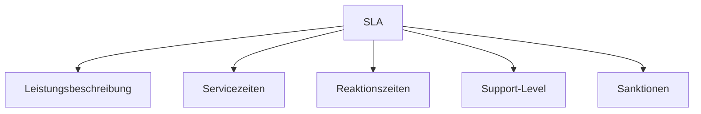

---
# Identity (stable; never change after publishing)
id: ap1-0239
slug: service-level-agreement-sla-definition

# Display
title: "Service Level Agreement (SLA)"

# Classification / navigation (machine-side)
module: "auftragsabwicklung-und-leistungserbringung"
topics: ["sla", "service-management", "it-support"]
tags: ["vertrag", "servicelevel", "reaktionszeit", "it-service"]

# Flashcard payload
card:
  type: basic
  question: "Was versteht man in der Informationstechnologie unter dem Begriff Service Level Agreement (SLA)?"
  answer: "Ein SLA ist eine vertragliche Vereinbarung zwischen Kunde und Anbieter, die Leistungsumfang, Qualität und Reaktionszeiten von IT-Services definiert."
  examples: []

# Lifecycle
status: published       # draft | published | deprecated
created: "2026-03-28"  
updated: "2026-03-28"
---

## Service Level Agreement (SLA)

Ein Service Level Agreement (SLA) ist die Grundlage für die Qualitätssicherung von IT-Dienstleistungen zwischen Anbieter und Kunde.

## Kernerklärung
SLAs legen verbindlich fest, **welche Leistungen in welcher Qualität erbracht werden müssen**.

Typische Inhalte eines SLA:

- **Vertragslaufzeit**
- **Vertragsziele** (z. B. minimale Ausfallzeiten)
- **Servicezeiten** (z. B. Mo–Fr 07:00–18:00 Uhr)
- **Verantwortlichkeiten** (Kunde & Anbieter)
- **Kommunikationswege** (z. B. Mail, Hotline)
- **Support-Level** (1st, 2nd, 3rd Level)
- **Reaktionszeiten** (z. B. Bearbeitung innerhalb 24h)
- **Sanktionen** bei Nichterfüllung

### Struktur eines SLA (vereinfacht)

## Praktisches Beispiel
Ein Unternehmen betreibt einen Webshop:

- SLA garantiert:
  - **99,5 % Verfügbarkeit**
  - **Reaktionszeit: 2 Stunden bei Störungen**
  - **Supportzeiten: Mo–Fr 08:00–18:00**

→ Bei Verstoß (z. B. längerer Ausfall) erhält der Kunde eine **Gutschrift**.

## Prüfungsrelevanz (AP1)
Sehr häufiges Thema im Bereich **IT-Service und Verträge**.

### Typische Prüfungsfragen
- Was ist ein SLA?
- Welche Inhalte gehören in ein SLA?
- Welche Bedeutung haben Reaktionszeiten?

### Antworten auf die typischen Prüfungsfragen
- SLA = vertraglich definierte Servicequalität
- Enthält u. a.:
  - Servicezeiten
  - Reaktionszeiten
  - Verantwortlichkeiten
- Reaktionszeiten bestimmen, **wie schnell auf Probleme reagiert werden muss**

## Merksatz
**Ein SLA legt fest: Welche Leistung, in welcher Qualität und in welcher Zeit erbracht wird.**