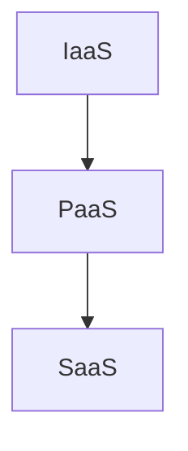

---
# Identity (stable; never change after publishing)
id: ap1-0246
slug: cloud-computing-iaas-paas-saas

# Display
title: "Cloud-Computing: IaaS, PaaS und SaaS"

# Classification / navigation (machine-side)
module: "auftragsabwicklung-und-leistungserbringung"
topics: ["cloud-computing", "it-architektur", "services"]
tags: ["iaas", "paas", "saas", "cloud"]

# Flashcard payload
card:
  type: basic
  question: "Unterscheide die 3 Cloud-Computing Begriffe IaaS, SaaS und PaaS."
  answer: "IaaS: Bereitstellung von IT-Infrastruktur\nPaaS: Bereitstellung von Entwicklungs- und Laufzeitumgebungen\nSaaS: Bereitstellung fertiger Software als Service"
  examples: []

# Lifecycle
status: published       # draft | published | deprecated
created: "2026-03-28"
updated: "2026-03-28"
---

## Cloud-Computing: IaaS, PaaS und SaaS

Cloud Computing stellt IT-Ressourcen als Services bereit. Dabei unterscheidet man drei grundlegende Service-Modelle.

## Kernerklärung
Die drei Cloud-Service-Modelle bauen logisch aufeinander auf:

### IaaS (Infrastructure as a Service)
- Bereitstellung von:
  - Servern
  - Speicher
  - Netzwerken
- Ersatz für klassische Rechenzentren
- Nutzer verwaltet Betriebssystem und Anwendungen selbst

### PaaS (Platform as a Service)
- Bereitstellung von:
  - Entwicklungsumgebungen
  - Laufzeitumgebungen
- Entwickler können Anwendungen erstellen, ohne sich um Infrastruktur zu kümmern

### SaaS (Software as a Service)
- Bereitstellung fertiger Software
- Nutzung über Internet (z. B. Browser)
- Keine Installation notwendig

### Vergleich der Modelle

| Modell | Was wird bereitgestellt? | Nutzer kümmert sich um |
|--------|--------------------------|------------------------|
| IaaS   | Infrastruktur            | OS, Anwendungen        |
| PaaS   | Plattform                | Anwendungen            |
| SaaS   | Software                | Nutzung                |

### Schichtenmodell

## Praktisches Beispiel
Ein Unternehmen nutzt Cloud-Dienste:

- **IaaS**: Virtuelle Server bei einem Anbieter  
- **PaaS**: Entwicklungsplattform für Webanwendungen  
- **SaaS**: E-Mail-Dienst im Browser  

## Prüfungsrelevanz (AP1)
Sehr häufiges Thema im Bereich **Cloud & IT-Infrastruktur**.

### Typische Prüfungsfragen
- Was ist der Unterschied zwischen IaaS, PaaS und SaaS?
- Wer ist für welche Aufgaben verantwortlich?
- Welche Vorteile bietet Cloud Computing?

### Antworten auf die typischen Prüfungsfragen
- IaaS = Infrastruktur, PaaS = Plattform, SaaS = Software  
- Verantwortung nimmt von IaaS → SaaS ab  
- Vorteile:
  - Skalierbarkeit
  - Kostenersparnis
  - Flexibilität

## Merksatz
**IaaS = Hardware, PaaS = Plattform, SaaS = fertige Software**