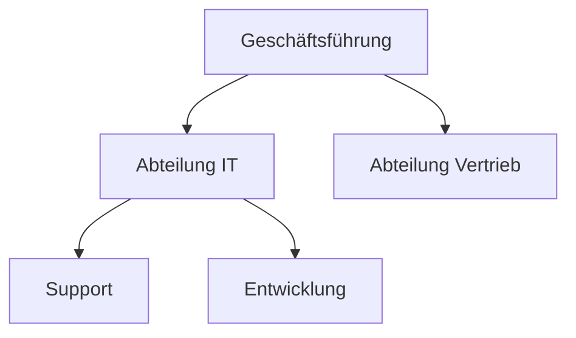

---
# Identity (stable; never change after publishing)
id: ap1-0247
slug: organigramm-definition

# Display
title: "Organigramm"

# Classification / navigation (machine-side)
module: "auftragsabwicklung-und-leistungserbringung"
topics: ["organisation", "unternehmensstruktur", "management"]
tags: ["organigramm", "aufbauorganisation", "hierarchie"]

# Flashcard payload
card:
  type: basic
  question: "Was ist ein Organigramm?"
  answer: "Ein Organigramm ist ein grafisches Schaubild der Aufbauorganisation eines Unternehmens, das Struktur, Zuständigkeiten und Weisungsbeziehungen darstellt."
  examples: []

# Lifecycle
status: published       # draft | published | deprecated
created: "2026-03-28"
updated: "2026-03-28"
---

## Organigramm

Ein Organigramm visualisiert die interne Struktur eines Unternehmens und zeigt, wie Aufgaben, Verantwortlichkeiten und Hierarchien organisiert sind.

## Kernerklärung
Ein Organigramm ist eine **grafische Darstellung der Aufbauorganisation** eines Unternehmens.

Es zeigt:

- **Unternehmensstruktur**
  - Abteilungen, Stellen, Bereiche

- **Aufgabenverteilung**
  - Wer für was zuständig ist

- **Hierarchien**
  - Über- und Unterordnungsverhältnisse

- **Weisungsbeziehungen**
  - Wer wem Anweisungen geben darf

- **Leitungs- und Stabsstellen**
  - Führung und unterstützende Funktionen

Zusätzliche Inhalte können sein:

- Standorte und Unternehmensverbund
- Personelle Besetzung von Stellen

### Typischer Aufbau

## Praktisches Beispiel
Ein mittelständisches Unternehmen:

- Geschäftsführung an der Spitze  
- Darunter:
  - IT-Abteilung (Support, Entwicklung)
  - Vertrieb
  - Personal  

→ Das Organigramm zeigt klar, **wer wem unterstellt ist**.

## Prüfungsrelevanz (AP1)
Grundlagenwissen im Bereich **Organisation & Unternehmensstruktur**.

### Typische Prüfungsfragen
- Was ist ein Organigramm?
- Welche Informationen enthält ein Organigramm?
- Was versteht man unter Weisungsbeziehungen?

### Antworten auf die typischen Prüfungsfragen
- Organigramm = grafische Darstellung der Unternehmensstruktur  
- Es zeigt:
  - Aufbauorganisation
  - Hierarchien
  - Zuständigkeiten  
- Weisungsbeziehungen zeigen, wer Anweisungen geben darf

## Merksatz
**Organigramm = Struktur + Hierarchie + Zuständigkeiten auf einen Blick**