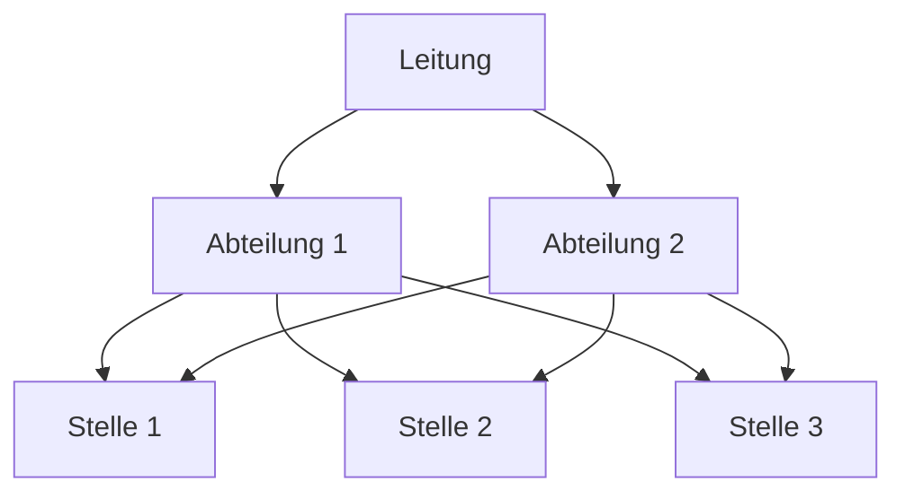

---
# Identity (stable; never change after publishing)
id: ap1-0249
slug: mehrliniensystem

# Display
title: "Mehrliniensystem"

# Classification / navigation (machine-side)
module: "auftragsabwicklung-und-leistungserbringung"
topics: ["organisation", "leitungssysteme", "management"]
tags: ["mehrliniensystem", "weisungsbeziehung", "organisation"]

# Flashcard payload
card:
  type: basic
  question: "Was versteht man bei den Leitungssystemen unter einem Mehrliniensystem?"
  answer: "Im Mehrliniensystem erhält eine untergeordnete Stelle Anweisungen von mehreren übergeordneten Stellen."
  examples: []

# Lifecycle
status: published       # draft | published | deprecated
created: "2026-03-28"
updated: "2026-03-28"
---

## Mehrliniensystem

Das Mehrliniensystem ist ein Leitungssystem innerhalb der Aufbauorganisation, bei dem mehrere Vorgesetzte Weisungsbefugnis haben.

## Kernerklärung
Im **Mehrliniensystem**:

- Eine Stelle hat **mehrere Vorgesetzte**
- Es gibt **mehrere Weisungslinien**
- Entscheidungen können über **verschiedene Wege** getroffen werden

### Merkmale
- Fachliche Spezialisierung
- Kurze Kommunikationswege
- Mehrere Ansprechpartner

### Visualisierung

## Praktisches Beispiel
Ein Mitarbeiter im IT-Bereich erhält:

- Fachliche Anweisungen vom **Projektleiter**
- Organisatorische Anweisungen vom **Abteilungsleiter**

→ Dadurch hat er **mehrere Vorgesetzte gleichzeitig**.

## Prüfungsrelevanz (AP1)
Wichtig im Bereich **Organisationsformen & Leitungssysteme**.

### Typische Prüfungsfragen
- Was ist ein Mehrliniensystem?
- Welche Vor- und Nachteile hat es?
- Worin unterscheidet es sich vom Einliniensystem?

### Antworten auf die typischen Prüfungsfragen
- Mehrliniensystem = mehrere Vorgesetzte pro Stelle  
- Vorteil:
  - Spezialisierung
  - schnelle Entscheidungen  
- Nachteil:
  - Konfliktpotenzial
  - unklare Zuständigkeiten  

## Merksatz
**Mehrliniensystem = mehrere Chefs für eine Stelle**