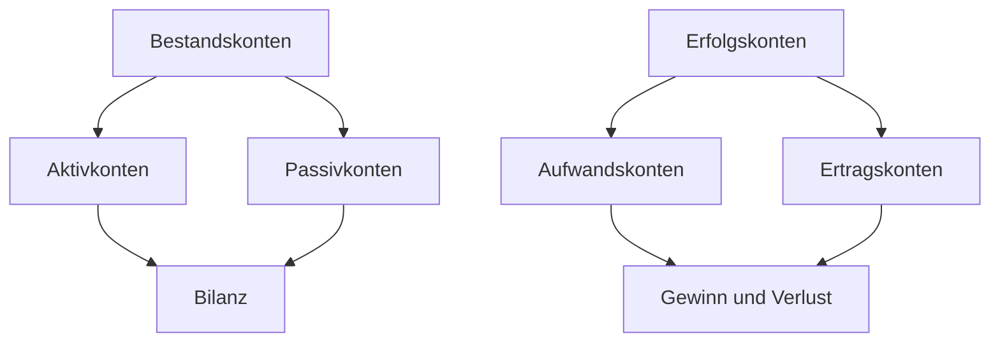

---
# Identity (stable; never change after publishing)
id: ap1-0255
slug: doppelte-buchfuehrung

# Display
title: "Doppelte Buchführung"

# Classification / navigation (machine-side)
module: "auftragsabwicklung-und-leistungserbringung"
topics: ["rechnungswesen", "buchfuehrung"]
tags: ["doppelte-buchfuehrung", "soll-haben", "bestandskonten", "erfolgskonten"]

# Flashcard payload
card:
  type: basic
  question: "Erläutere den Begriff der doppelten Buchführung."
  answer: "Die doppelte Buchführung ist eine Buchungsmethode, bei der jeder Geschäftsfall doppelt erfasst wird: einmal im Soll und einmal im Haben. Dadurch werden Mittelherkunft und Mittelverwendung nachvollziehbar."
  examples: []

# Lifecycle
status: published       # draft | published | deprecated  
created: "2026-03-29"
updated: "2026-03-29"
---

## Doppelte Buchführung

Die doppelte Buchführung ist eine Methode der Buchhaltung, bei der **jeder Geschäftsvorfall auf zwei Konten** erfasst wird.  
Dadurch lässt sich nachvollziehen, **was sich verändert hat** und **woher die Veränderung kommt**.

## Kernerklärung

Bei der doppelten Buchführung gilt:

- Jeder Geschäftsfall wird **zweimal gebucht**:
  - einmal im **Soll**
  - einmal im **Haben**

Das bedeutet nicht, dass etwas doppelt bezahlt wird.  
Gemeint ist: **Jeder Vorgang hat immer zwei Seiten**.

### Grundidee
Ein Unternehmen kauft, verkauft, zahlt oder erhält Geld.  
Bei jedem Vorgang verändert sich immer mindestens zweierlei, zum Beispiel:

- ein Vermögenswert steigt
- gleichzeitig sinkt Kasse oder es entstehen Schulden

Deshalb wird ein Vorgang auf **zwei Konten** gebucht.

### Ziel der doppelten Buchführung
Sie dient dazu, sichtbar zu machen:

- **Mittelverwendung**  
  → Wofür wurde Geld oder Wert eingesetzt?
- **Mittelherkunft**  
  → Woher kommt das Geld oder der Gegenwert?

### Kontenarten aus der Karte

Die Karte zeigt zwei grundlegende Kontenbereiche:

| Bereich | Kontenart | Beispiele | Abschluss |
|---|---|---|---|
| Bestandskonten | Aktivkonten | Kasse, Bank, Fuhrpark | Bilanz |
| Bestandskonten | Passivkonten | Darlehen, Verbindlichkeiten | Bilanz |
| Erfolgskonten | Aufwandskonten | Miete, Gehälter, Material | Gewinn und Verlust |
| Erfolgskonten | Ertragskonten | Umsatzerlöse, Zinserträge | Gewinn und Verlust |

### Zusammenhang der Konten
- **Bestandskonten** zeigen Vermögen und Kapital eines Unternehmens.
- **Erfolgskonten** zeigen, ob das Unternehmen Gewinn oder Verlust macht.
- Am Jahresende fließen:
  - **Bestandskonten** in die **Bilanz**
  - **Erfolgskonten** in die **Gewinn-und-Verlust-Rechnung (GuV)**

### Einfache Merkhilfe zu Soll und Haben
Für Einsteiger ist wichtig:

- **Soll** = linke Kontoseite
- **Haben** = rechte Kontoseite

Soll und Haben bedeuten **nicht automatisch**:
- Soll = schlecht
- Haben = gut

Es sind zuerst nur die **beiden Seiten eines Kontos**.

### Darstellung des Zusammenhangs

## Praktisches Beispiel

Ein Unternehmen kauft einen Laptop für 1.000 € auf Rechnung.

Was passiert dabei?

- Das Unternehmen erhält einen Laptop  
  → Vermögen steigt
- Das Unternehmen muss später zahlen  
  → Verbindlichkeiten steigen

Buchung:

- **Soll:** Büroausstattung / Anlagevermögen
- **Haben:** Verbindlichkeiten aus Lieferungen und Leistungen

Damit sieht man beide Seiten des Geschäftsfalls:

- **Was wurde gekauft?**
- **Wie wurde es finanziert?**

## Prüfungsrelevanz (AP1)

Die doppelte Buchführung ist ein typisches Grundlagenthema in AP1, weil hier geprüft wird, ob du das Prinzip hinter Buchungen verstehst.

### Typische Prüfungsfragen

- Was bedeutet doppelte Buchführung?
- Warum wird jeder Geschäftsfall doppelt gebucht?
- Welche Kontenarten gibt es?
- Was ist der Unterschied zwischen Bestandskonten und Erfolgskonten?
- Wohin werden diese Konten abgeschlossen?

### Antworten auf die typischen Prüfungsfragen

- Doppelte Buchführung bedeutet, dass jeder Geschäftsfall **im Soll und im Haben** erfasst wird.
- Doppelt gebucht wird, weil jeder Vorgang **zwei Auswirkungen** hat.
- Es gibt:
  - **Bestandskonten**
  - **Erfolgskonten**
- Bestandskonten betreffen Vermögen und Kapital, Erfolgskonten betreffen Aufwand und Ertrag.
- Bestandskonten werden über die **Bilanz**, Erfolgskonten über **Gewinn und Verlust** abgeschlossen.

## Merksatz

**Kein Geschäftsfall ohne Gegenbuchung: Jede Buchung hat eine Soll- und eine Habenseite.**