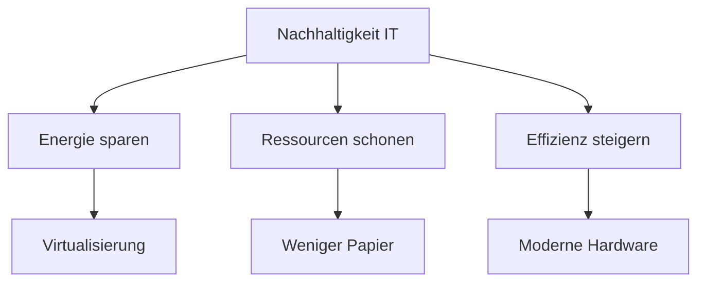

---
# Identity (stable; never change after publishing)
id: ap1-0260
slug: nachhaltigkeit-informationstechnologie

# Display
title: "Nachhaltigkeit in der Informationstechnologie"

# Classification / navigation (machine-side)
module: "auftragsabwicklung-und-leistungserbringung"
topics: ["it", "nachhaltigkeit"]
tags: ["green-it", "energieeffizienz", "ressourcen"]

# Flashcard payload
card:
  type: basic
  question: "Was versteht man unter dem Begriff Nachhaltigkeit in der Informationstechnologie-Branche?"
  answer: "Nachhaltigkeit bedeutet in der IT ein verantwortungsvolles Handeln zur Schonung von Ressourcen, z. B. durch Energieeinsparung, effiziente Technologien, Nutzung erneuerbarer Energien und Reduzierung von Verbrauch."
  examples: []

# Lifecycle
status: published       # draft | published | deprecated
created: "2026-03-29"
updated: "2026-03-29"
---

## Nachhaltigkeit in der Informationstechnologie

Nachhaltigkeit in der IT bedeutet, **Ressourcen bewusst und umweltschonend einzusetzen**.

Ziel:  

- Umwelt schützen  
- Energie sparen  
- Ressourcen effizient nutzen  

---

## Kernerklärung

Nachhaltigkeit umfasst in der IT mehrere konkrete Maßnahmen:

- **Energieeinsparung**
  - z. B. durch Virtualisierung

- **Erhöhung der Energieeffizienz**
  - z. B. Nutzung von Standby-Technologien

- **Nutzung erneuerbarer Energien**
  - z. B. grüne Rechenzentren

- **Reduzierung von Materialverbrauch**
  - z. B. weniger Papier, Druckfarbe, Plastik

- **Effiziente Kühlung**
  - z. B. Free Cooling (Nutzung von Außenluft/Kaltwasser)

---

### Zusammenhang

---

## Praktisches Beispiel

- Server werden virtualisiert → weniger physische Geräte  
- Unternehmen nutzt Ökostrom → geringere Umweltbelastung  
- Dokumente werden digital statt gedruckt → weniger Papierverbrauch  

---

## Prüfungsrelevanz (AP1)

### Typische Prüfungsfragen
- Was bedeutet Nachhaltigkeit in der IT?
- Nenne Maßnahmen der Green IT.
- Warum ist Nachhaltigkeit wichtig?

### Antworten auf die typischen Prüfungsfragen
- Schonung von Ressourcen durch effiziente IT-Nutzung  
- Energie sparen, erneuerbare Energien, weniger Materialverbrauch  
- Umwelt schützen und Kosten senken  

---

## Merksatz

**Nachhaltige IT = weniger Energie + weniger Ressourcen + mehr Effizienz**