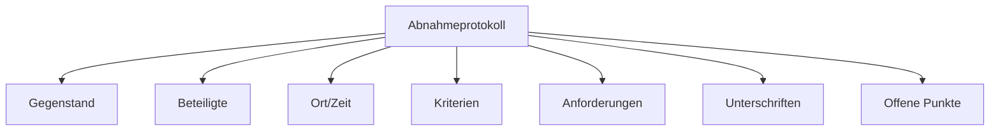

---
# Identity (stable; never change after publishing)
id: ap1-0261
slug: abnahmeprotokoll-bestandteile

# Display
title: "Bestandteile eines Abnahmeprotokolls (IT-Projekt)"

# Classification / navigation (machine-side)
module: "auftragsabwicklung-und-leistungserbringung"
topics: ["projektmanagement", "abnahme"]
tags: ["abnahme", "dokumentation", "it-projekt"]

# Flashcard payload
card:
  type: basic
  question: "Nenne die wesentlichen Bestandteile eines Abnahmeprotokolls für ein IT-Projekt."
  answer: "Wesentliche Bestandteile sind: Gegenstand der Abnahme, beteiligte Personen/Firmen, Ort/Datum/Uhrzeit, Abnahmekriterien und Qualität, Nachweis der Anforderungen, Unterschriften sowie offene Punkte."
  examples: []

# Lifecycle
status: published       # draft | published | deprecated
created: "2026-03-29"
updated: "2026-03-29"
---

## Abnahmeprotokoll: Bestandteile

Ein Abnahmeprotokoll dokumentiert, ob ein IT-Projekt **ordnungsgemäß geliefert und akzeptiert wurde**.

Es ist die Grundlage für die **offizielle Übergabe an den Kunden**

---

## Kernerklärung

Wichtige Bestandteile eines Abnahmeprotokolls:

- **Gegenstand der Abnahme**
  - Was wurde geliefert? (System, Software, Leistung)

- **Beteiligte Personen / Firmen**
  - Auftraggeber und Auftragnehmer

- **Ort, Datum, Uhrzeit**
  - Wann und wo fand die Abnahme statt?

- **Abnahmekriterien**
  - Vollständigkeit der Lieferung
  - Qualität der Leistungen

- **Erfüllung der Anforderungen**
  - Funktionale Anforderungen  
  - Nicht-funktionale Anforderungen  

- **Unterschriften**
  - Autorisierte Vertreter beider Seiten

- **Offene Punkte**
  - Mängel, Restarbeiten, To-dos

---

### Struktur eines Abnahmeprotokolls

---

## Praktisches Beispiel

Ein Kunde nimmt eine neue Software ab:

- System funktioniert laut Anforderungen → ✔️  
- Zwei kleine Bugs vorhanden → werden dokumentiert  
- Kunde unterschreibt → Projekt gilt als **abgenommen**

---

## Prüfungsrelevanz (AP1)

### Typische Prüfungsfragen
- Was gehört in ein Abnahmeprotokoll?
- Warum ist es wichtig?
- Was passiert bei offenen Mängeln?

### Antworten auf die typischen Prüfungsfragen
- Inhalte: Gegenstand, Beteiligte, Kriterien, Unterschriften, offene Punkte  
- Wichtig für rechtliche Absicherung und Projektabschluss  
- Mängel werden dokumentiert und nachgebessert  

---

## Merksatz

**Abnahmeprotokoll = Was wurde geliefert + erfüllt + unterschrieben + noch offen**