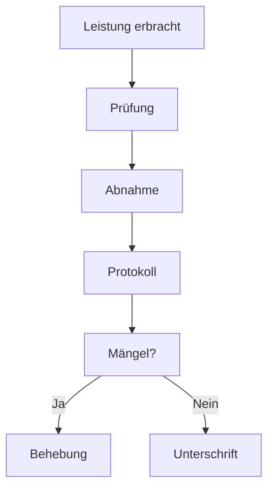

---
# Identity (stable; never change after publishing)
id: ap1-0262
slug: schritte-nach-leistungserbringung

# Display
title: "Schritte nach Abschluss der Leistungserbringung"

# Classification / navigation (machine-side)
module: "auftragsabwicklung-und-leistungserbringung"
topics: ["projektabschluss", "abnahme"]
tags: ["abnahme", "leistungserbringung", "projekt"]

# Flashcard payload
card:
  type: basic
  question: "Welche Schritte sind notwendig nach Abschluss erfolgter Leistungserbringung?"
  answer: "Nach der Leistungserbringung erfolgt die (Teil- oder Voll-)Abnahme durch den Auftraggeber, die Prüfung der Leistungen, die Dokumentation im Abnahmeprotokoll, die Behandlung von Mängeln sowie die Unterschriften beider Parteien."
  examples: []

# Lifecycle
status: published       # draft | published | deprecated 
created: "2026-03-29"
updated: "2026-03-29"
---

## Schritte nach Abschluss der Leistungserbringung

Nach der Leistungserbringung wird das Ergebnis **offiziell geprüft und abgenommen**.

Ziel: Sicherstellen, dass alles **vertragsgemäß geliefert wurde**

---

## Kernerklärung

Die typischen Schritte nach der Leistungserbringung:

1. **Abnahme durch den Auftraggeber**
   - Teil- oder Vollabnahme möglich

2. **Prüfung der Leistungen**
   - Funktionalität und Korrektheit
   - Vergleich mit Anforderungen

3. **Dokumentation im Abnahmeprotokoll**
   - Ort, Datum, beteiligte Personen
   - Ergebnisse der Prüfung

4. **Feststellung von Mängeln**
   - qualitativ (z. B. Fehler)
   - quantitativ (z. B. unvollständig)

5. **Fristen zur Mängelbeseitigung**
   - ggf. Ersatzlieferung

6. **Unterschriften**
   - Auftraggeber und Auftragnehmer

7. **Hinweis auf Gewährleistung / Garantie**
   - Beginn nach Abnahme

---

### Ablauf

---

## Praktisches Beispiel

- Software wird geliefert  
- Kunde testet Funktionen → ✔️  
- Kleine Fehler werden dokumentiert  
- Frist zur Behebung wird gesetzt  
- Nach Korrektur → Unterschrift → Projekt abgeschlossen  

---

## Prüfungsrelevanz (AP1)

### Typische Prüfungsfragen
- Was passiert nach der Leistungserbringung?
- Welche Rolle spielt die Abnahme?
- Was passiert bei Mängeln?

### Antworten auf die typischen Prüfungsfragen
- Prüfung, Abnahme, Protokollierung, Unterschrift  
- Abnahme bestätigt die Vertragserfüllung  
- Mängel werden dokumentiert und behoben  

---

## Merksatz

**Liefern → Prüfen → Abnehmen → Dokumentieren → Unterschreiben**