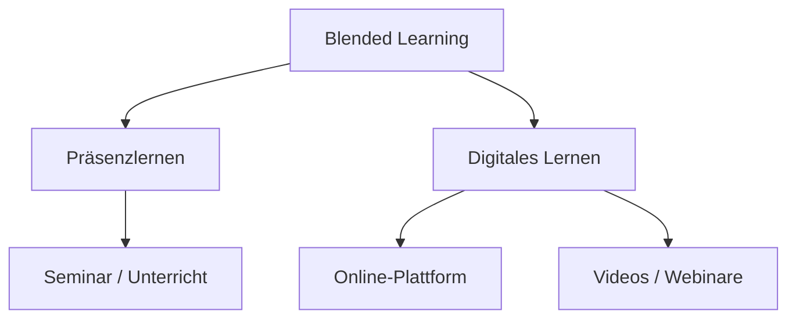

---
# Identity (stable; never change after publishing)
id: ap1-0264
slug: blended-learning

# Display
title: "Blended Learning (hybrides Lernen)"

# Classification / navigation (machine-side)
module: "auftragsabwicklung-und-leistungserbringung"
topics: ["schulung", "lernmethoden"]
tags: ["blended-learning", "e-learning", "weiterbildung"]

# Flashcard payload
card:
  type: basic
  question: "Welche Bedeutung hat der Begriff Blended Learning?"
  answer: "Blended Learning ist eine Lernform, bei der Präsenzunterricht mit digitalen Lernmethoden kombiniert wird, um flexibles und effektives Lernen zu ermöglichen."
  examples: []

# Lifecycle
status: published       # draft | published | deprecated
created: "2026-03-29"
updated: "2026-03-29"
---

## Blended Learning (hybrides Lernen)

**Blended Learning (hybrides Lernen)** kombiniert klassische und digitale Lernformen.

Ziel: **flexibleres, effektiveres Lernen**

---

## Kernerklärung

Blended Learning verbindet zwei Lernarten:

- **Präsenzlernen**
  - Unterricht im Klassenraum oder Seminarraum
  - direkter Austausch mit Trainer

- **Digitales Lernen**
  - Lernplattformen (z. B. Moodle, Canvas)
  - Videos, Webinare, E-Books

---

### Ziel des Blended Learning

- Nutzung der **Vorteile beider Lernformen**
- Kombination aus:
  - persönlicher Betreuung
  - zeit- und ortsunabhängigem Lernen

---

### Vorteile

- **Flexibilität** (Lernen jederzeit möglich)
- **Effizienz** (optimale Kombination von Methoden)
- **Kosteneinsparung** (weniger Reisen & Seminare)

---

### Aufbau

---

## Praktisches Beispiel

Ein Kurs besteht aus:

- Präsenzseminar im Schulungsraum  
- Online-Lernplattform mit Aufgaben  
- Video-Tutorials zur Wiederholung  

Kombination sorgt für nachhaltiges Lernen

---

## Prüfungsrelevanz (AP1)

### Typische Prüfungsfragen
- Was ist Blended Learning?
- Welche Vorteile hat diese Methode?
- Welche Lernformen werden kombiniert?

### Antworten auf die typischen Prüfungsfragen
- Kombination aus Präsenz- und Online-Lernen  
- Vorteile: flexibel, effizient, kostensparend  
- Mischung aus Unterricht + digitalen Medien  

---

## Merksatz

**Blended Learning = Präsenzlernen + digitales Lernen kombiniert**