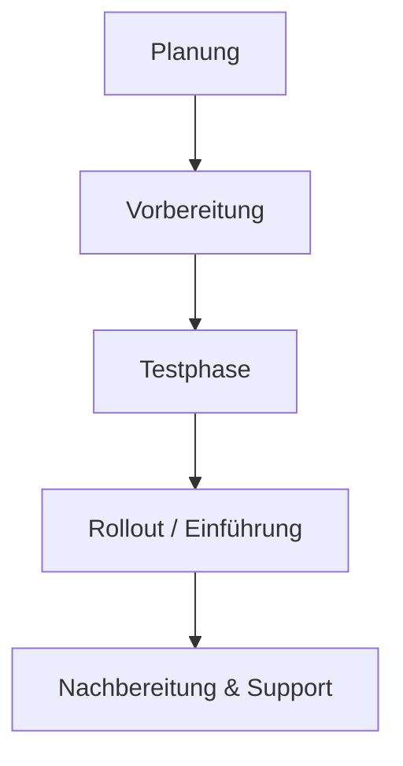

---
# Identity (stable; never change after publishing)
id: ap1-0265
slug: rollout

# Display
title: "Rollout (Einführung von IT-Systemen)"

# Classification / navigation (machine-side)
module: "auftragsabwicklung-und-leistungserbringung"
topics: ["einführung", "it-systeme"]
tags: ["rollout", "deployment", "hardware", "software"]

# Flashcard payload
card:
  type: basic
  question: "Was verbirgt sich hinter dem Begriff Rollout?"
  answer: "Ein Rollout bezeichnet die Einführung bzw. Verteilung neuer Hard- oder Software, z. B. durch Austausch alter Systeme oder Bereitstellung neuer Systeme an einem Standort oder im gesamten Unternehmen."
  examples: []

# Lifecycle
status: published       # draft | published | deprecated
created: "2026-03-29"
updated: "2026-03-29"
---

## Rollout (Einführung von IT-Systemen)

**Rollout** bedeutet die **Einführung und Verteilung neuer IT-Systeme**.

Kann Hardware, Software oder ganze Systeme betreffen

---

## Kernerklärung

Der Begriff stammt aus dem Englischen („ausrollen“).

Ein Rollout beschreibt:

- Einführung neuer **Hard- und Software**
- Verteilung im Unternehmen oder an bestimmten Standorten
- Teil eines **Einführungsprozesses**

---

### Arten von Rollouts

| Art | Beschreibung |
|-----|-------------|
| Hardware-Rollout | Austausch alter Geräte gegen neue |
| Software-Rollout | Installation/Verteilung neuer Programme |
| Standort-Rollout | Einführung an einem bestimmten Ort |
| Unternehmensweiter Rollout | Einführung im gesamten Unternehmen |

---

### Typischer Ablauf

---

## Praktisches Beispiel

Ein Unternehmen ersetzt alle alten PCs:

- Neue Geräte werden geliefert  
- Alte Hardware wird ausgetauscht  
- Software wird installiert  
- Mitarbeitende beginnen mit der Nutzung  

Das ist ein **Hardware- und Software-Rollout**

---

## Prüfungsrelevanz (AP1)

### Typische Prüfungsfragen
- Was ist ein Rollout?
- Welche Arten von Rollouts gibt es?
- Was passiert bei einem Rollout?

### Antworten auf die typischen Prüfungsfragen
- Einführung und Verteilung neuer IT-Systeme  
- Hardware-, Software- oder kombinierte Rollouts  
- Austausch, Installation und Inbetriebnahme neuer Systeme  

---

## Merksatz

**Rollout = Einführung und Verteilung neuer IT-Systeme**