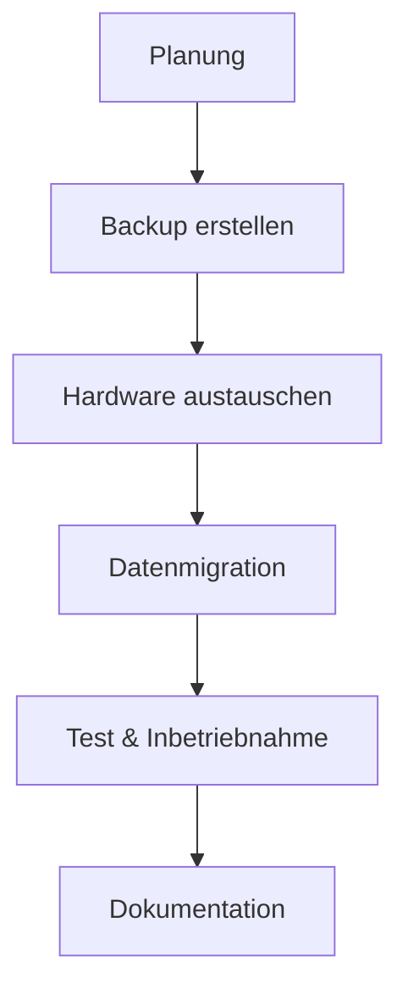

---
# Identity (stable; never change after publishing)
id: ap1-0267
slug: it-hardware-rollout

# Display
title: "IT-Hardware-Rollout"

# Classification / navigation (machine-side)
module: "auftragsabwicklung-und-leistungserbringung"
topics: ["rollout", "hardware"]
tags: ["hardware-rollout", "migration", "deployment"]

# Flashcard payload
card:
  type: basic
  question: "Welche Dinge müssen bei einem IT-Hardware-Rollout beachtet werden?"
  answer: "Beim IT-Hardware-Rollout müssen u. a. Rollout-Management, Datenmigration, Asset-Dokumentation, Kompatibilitätsprüfung, Backupkonzept, Terminüberwachung und Abstimmung mit dem Kunden berücksichtigt werden."
  examples: []

# Lifecycle
status: published       # draft | published | deprecated
created: "2026-03-29"
updated: "2026-03-29"
---

## IT-Hardware-Rollout

Ein **IT-Hardware-Rollout** umfasst den **Austausch oder die Einführung neuer Hardware** im Unternehmen.

-> Dabei sind organisatorische, technische und zeitliche Aspekte wichtig

---

## Kernerklärung

Folgende Punkte müssen berücksichtigt werden:

- **Rollout-Manager einsetzen**
  - Koordiniert und überwacht den gesamten Prozess

- **Datenmigration**
  - Übertragung von Daten von alter auf neue Hardware

- **Asset-Dokumentation**
  - Erfassung und Verwaltung von Geräten (z. B. Asset-Tags)

- **Kompatibilität prüfen**
  - Software muss auf neuer Hardware funktionieren

- **Backupkonzept**
  - Datensicherung vor dem Austausch

- **Terminüberwachung**
  - Zeitplanung und Kontrolle des Rollouts

- **Abstimmung mit Kunden**
  - Klärung von Ort, Zeit und Ablauf

---

### Ablauf eines Hardware-Rollouts

---

## Praktisches Beispiel

Ein Unternehmen ersetzt alle Arbeitsplatz-PCs:

- Backup der alten Systeme  
- Austausch der Hardware  
- Daten werden übertragen  
- Systeme werden getestet  
- Geräte werden dokumentiert  

-> Strukturierter Hardware-Rollout

---

## Prüfungsrelevanz (AP1)

### Typische Prüfungsfragen
- Welche Schritte gehören zu einem Hardware-Rollout?
- Warum ist ein Backup wichtig?
- Was ist die Aufgabe eines Rollout-Managers?

### Antworten auf die typischen Prüfungsfragen
- Planung, Backup, Austausch, Migration, Test und Dokumentation  
- Schutz vor Datenverlust  
- Koordination und Überwachung des Prozesses  

---

## Merksatz

**Hardware-Rollout = Planen → Sichern → Austauschen → Migrieren → Testen**