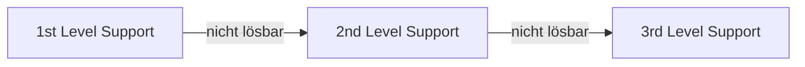

---
# Identity (stable; never change after publishing)
id: ap1-0338
slug: eskalationsstufe-it-kundensupport-modell

# Display
title: "Eskalationsstufen im 3-stufigen IT-Kundensupport-Modell"

# Classification / navigation (machine-side)
module: "auftragsabwicklung-und-leistungserbringung"
topics: ["it-support", "eskalation", "service-level"]
tags: ["1st-level", "2nd-level", "3rd-level", "sla"]

# Flashcard payload
card:
  type: basic
  question: "Wie wird der Begriff Eskalationsstufe im 3-stufigen IT-Kundensupport-Modell definiert?"
  answer: "Eskalationsstufen sind definierte Support-Ebenen nach Schweregrad eines Falls.\n1st Level: erste Anlaufstelle\n2nd Level: Spezialisten (Incident Management)\n3rd Level: Experten/Entwickler"
  examples: []

# Lifecycle
status: published       # draft | published | deprecated
created: "2026-03-28"
updated: "2026-03-28"
---

## Eskalationsstufen im 3-stufigen IT-Kundensupport-Modell

Eskalationsstufen strukturieren den IT-Support in mehrere Ebenen, um Supportfälle effizient und entsprechend ihrer Komplexität zu bearbeiten.

## Kernerklärung
Im IT-Kundensupport werden Fälle nach **Schweregrad und Komplexität** in Eskalationsstufen eingeordnet.

### Auslöser für Eskalation
- **Schweregrad des Problems** (z. B. Systemausfall vs. kleiner Fehler)
- **Zeitfaktor (SLA)**  
  → Eskalation, wenn ein Problem nicht innerhalb der vereinbarten Zeit gelöst wird
- **Vordefinierte Supportregeln**

### Eskalationshierarchie

| Level       | Beschreibung |
|------------|-------------|
| 1st Level  | Erste Anlaufstelle für Kunden, Standardprobleme |
| 2nd Level  | IT-Spezialisten, tiefere Analyse, Incident Management |
| 3rd Level  | Experten / Entwickler, komplexe oder systemnahe Probleme |

### Ablauf (vereinfacht)

## Praktisches Beispiel
Ein Nutzer kann sich nicht anmelden:

- **1st Level**: Passwort zurücksetzen → Problem ungelöst  
- **2nd Level**: Analyse des Benutzerkontos → Fehler nicht eindeutig  
- **3rd Level**: Entwickler finden Bug im Authentifizierungssystem

## Prüfungsrelevanz (AP1)
Zentrales Thema im Bereich **IT-Service / Supportorganisation**.

### Typische Prüfungsfragen
- Was sind Eskalationsstufen?
- Welche Aufgaben haben die einzelnen Support-Level?
- Wann wird ein Supportfall eskaliert?

### Antworten auf die typischen Prüfungsfragen
- Eskalationsstufen = strukturierte Weitergabe von Supportfällen
- Level unterscheiden sich nach **Kompetenz und Verantwortung**
- Eskalation erfolgt bei:
  - hoher Komplexität
  - Zeitüberschreitung (SLA)
  - fehlender Lösung im vorherigen Level

## Merksatz
**Je komplexer oder dringender das Problem, desto höher die Eskalationsstufe.**