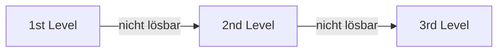

---
# Identity (stable; never change after publishing)
id: ap1-0341
slug: support-level-prinzip-first-second-third-level

# Display
title: "First-, Second- und Third-Level-Support"

# Classification / navigation (machine-side)
module: "auftragsabwicklung-und-leistungserbringung"
topics: ["it-support", "support-level", "eskalation"]
tags: ["1st-level", "2nd-level", "3rd-level", "supportprozess"]

# Flashcard payload
card:
  type: basic
  question: "Wie funktioniert das mehrstufige Prinzip des First-Level-, Second-Level- und Third-Level-Supports?"
  answer: "1st Level: erste Anlaufstelle, erfasst Anfragen und löst einfache Probleme\n2nd Level: Spezialisten bearbeiten komplexere Fälle\n3rd Level: Experten/Entwickler lösen tiefgehende oder systemnahe Probleme"
  examples: []

# Lifecycle
status: published       # draft | published | deprecated
created: "2026-03-28"
updated: "2026-03-28"
---

## First-, Second- und Third-Level-Support

Das mehrstufige Support-Modell dient dazu, IT-Probleme effizient nach Komplexität zu bearbeiten und schrittweise zu eskalieren.

## Kernerklärung
Das Support-System ist in drei Ebenen unterteilt:

### 1st Level Support
- Erste **Anlaufstelle für alle Supportanfragen**
- Erfassung aller relevanten Informationen
- Löst **Standardprobleme direkt**
- Eskaliert komplexe Fälle weiter

### 2nd Level Support
- **IT-Spezialisten**
- Bearbeitung komplexerer Probleme
- Einsatz, wenn 1st Level nicht ausreicht
- Dokumentation neuer Lösungen in Wissensdatenbanken

### 3rd Level Support
- **Höchste Eskalationsstufe**
- Experten / Entwickler / Hersteller
- Bearbeitung von:
  - tiefgehenden Systemproblemen
  - Softwarefehlern (Bugs)
- Kann zu **Produktänderungen oder Updates** führen

### Ablauf des Supports

## Praktisches Beispiel
Ein Mitarbeiter kann nicht auf ein System zugreifen:

- **1st Level**: Passwort zurücksetzen → Problem bleibt bestehen  
- **2nd Level**: Rechte und Konfiguration prüfen → Fehler unklar  
- **3rd Level**: Entwickler beheben Bug im System

## Prüfungsrelevanz (AP1)
Sehr häufige Aufgabe im Bereich **IT-Support / Serviceprozesse**.

### Typische Prüfungsfragen
- Welche Aufgaben haben die einzelnen Support-Level?
- Wann wird ein Problem eskaliert?
- Wer ist für welche Art von Problemen zuständig?

### Antworten auf die typischen Prüfungsfragen
- 1st Level = Annahme & einfache Lösungen  
- 2nd Level = Spezialisten für komplexe Fälle  
- 3rd Level = Experten/Entwickler für tiefgehende Probleme  
- Eskalation bei:
  - fehlender Lösung
  - hoher Komplexität

## Merksatz
**Vom Helpdesk zum Experten: 1st → 2nd → 3rd Level je nach Problemkomplexität.**