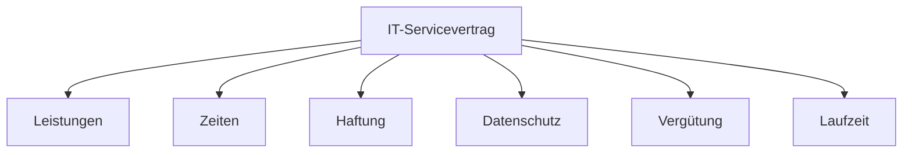

---
# Identity (stable; never change after publishing)
id: ap1-0343
slug: it-servicevertrag-bestandteile

# Display
title: "Bestandteile eines IT-Servicevertrags"

# Classification / navigation (machine-side)
module: "auftragsabwicklung-und-leistungserbringung"
topics: ["it-servicevertrag", "vertrag", "service-management"]
tags: ["wartung", "haftung", "datenschutz", "verguetung"]

# Flashcard payload
card:
  type: basic
  question: "Aus welchen Bestandteilen besteht in der Regel ein IT-Servicevertrag?"
  answer: "- Angaben zum Wartungsgegenstand (Systeme, Standorte)\n- Leistungen und Einsatzzeiten\n- Mitwirkungspflichten und Ansprechpartner\n- Mängelgewährleistung\n- Datenschutz und Datensicherheit\n- Haftung\n- Vergütung\n- Laufzeit und Kündigung\n- Nebenabreden / salvatorische Klausel"
  examples: []

# Lifecycle
status: published       # draft | published | deprecated
created: "2026-03-28"
updated: "2026-03-28"
---

## Bestandteile eines IT-Servicevertrags

Ein IT-Servicevertrag regelt die Zusammenarbeit zwischen Anbieter und Kunde für Wartung und Betrieb von IT-Systemen.

## Kernerklärung
IT-Serviceverträge enthalten typischerweise folgende Regelungen:

- **Wartungsgegenstand**
  - Welche Systeme und Standorte betroffen sind

- **Leistungen & Einsatzzeiten**
  - Welche Services erbracht werden
  - Wann diese verfügbar sind (z. B. Mo–Fr 08:00–16:00)

- **Mitwirkung & Ansprechpartner**
  - Pflichten des Kunden
  - Erreichbarkeit von Kontaktpersonen

- **Mängelgewährleistung**
  - Regelung bei Fehlern und Störungen

- **Datenschutz & Datensicherheit**
  - Umgang mit sensiblen Daten

- **Haftung**
  - Verantwortlichkeit bei Schäden (z. B. Datenverlust)

- **Vergütung**
  - Bezahlung der Leistungen

- **Laufzeit & Kündigung**
  - Vertragsdauer und Beendigung

- **Nebenabreden / salvatorische Klausel**
  - Zusatzvereinbarungen und rechtliche Absicherung

### Struktur eines IT-Servicevertrags

## Praktisches Beispiel
Ein Unternehmen beauftragt einen IT-Dienstleister:

- Wartung von Servern und Netzwerken
- Supportzeiten: Mo–Fr 08:00–16:00
- Reaktion bei Störungen innerhalb von 4 Stunden
- Monatliche Pauschale als Vergütung

## Prüfungsrelevanz (AP1)
Typisches Thema im Bereich **IT-Service & Vertragsgestaltung**.

### Typische Prüfungsfragen
- Welche Inhalte gehören in einen IT-Servicevertrag?
- Warum sind Einsatzzeiten wichtig?
- Welche Rolle spielt Datenschutz im Vertrag?

### Antworten auf die typischen Prüfungsfragen
- Vertrag enthält Leistungen, Zeiten, Haftung, Datenschutz, Vergütung usw.
- Einsatzzeiten definieren die Verfügbarkeit des Supports
- Datenschutz regelt den sicheren Umgang mit Kundendaten

## Merksatz
**IT-Servicevertrag = Leistung + Zeit + Verantwortung + Sicherheit + Bezahlung**