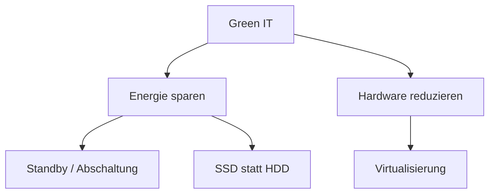

---
# Identity (stable; never change after publishing)
id: ap1-0344
slug: umweltschutz-it-betrieb-massnahmen

# Display
title: "Umweltschutzmaßnahmen im IT-Betrieb"

# Classification / navigation (machine-side)
module: "auftragsabwicklung-und-leistungserbringung"
topics: ["green-it", "nachhaltigkeit", "it-betrieb"]
tags: ["energieeffizienz", "virtualisierung", "ssd", "standby"]

# Flashcard payload
card:
  type: basic
  question: "Welche Maßnahmen eignen sich, um den Umweltschutz im IT-Betrieb stärker zu berücksichtigen?"
  answer: "- Einsatz von Green-IT-Komponenten\n- Nutzung von Standby-Regeln\n- Einsatz von SSD statt HDD\n- Nutzung von Abschaltautomatiken\n- Virtualisierung von Servern und Anwendungen"
  examples: []

# Lifecycle
status: published       # draft | published | deprecated
created: "2026-03-28"
updated: "2026-03-28"
---

## Umweltschutzmaßnahmen im IT-Betrieb

Umweltschutz im IT-Betrieb (Green IT) zielt darauf ab, Energieverbrauch und Ressourcenverbrauch zu reduzieren.

## Kernerklärung
Wichtige Maßnahmen zur Verbesserung der Umweltbilanz:

- **Green-IT-Komponenten**
  - Energieeffiziente Hardware einsetzen

- **Standby-Regeln**
  - Geräte bei Nichtnutzung in Energiesparmodus versetzen

- **SSD statt HDD**
  - Geringerer Stromverbrauch und höhere Effizienz

- **Abschaltautomatiken**
  - Automatisches Herunterfahren von Systemen außerhalb der Nutzungszeiten

- **Virtualisierung**
  - Mehrere Systeme auf einer Hardware bündeln → weniger Geräte notwendig

### Zusammenhang der Maßnahmen

## Praktisches Beispiel
Ein Unternehmen optimiert sein Rechenzentrum:

- Alte Server werden durch **virtualisierte Systeme** ersetzt  
- PCs schalten sich automatisch nach Feierabend aus  
- Neue Geräte nutzen **SSD statt HDD**

→ Ergebnis: **geringerer Stromverbrauch und weniger CO₂-Ausstoß**

## Prüfungsrelevanz (AP1)
Typisches Thema im Bereich **IT-Betrieb & Nachhaltigkeit**.

### Typische Prüfungsfragen
- Was versteht man unter Green IT?
- Welche Maßnahmen sparen Energie im IT-Betrieb?
- Warum ist Virtualisierung umweltfreundlich?

### Antworten auf die typischen Prüfungsfragen
- Green IT = nachhaltiger Einsatz von IT-Ressourcen
- Maßnahmen:
  - effiziente Hardware
  - Standby / Abschaltung
  - Virtualisierung
- Virtualisierung reduziert die Anzahl physischer Geräte

## Merksatz
**Green IT = weniger Energie + weniger Hardware = mehr Umweltschutz**