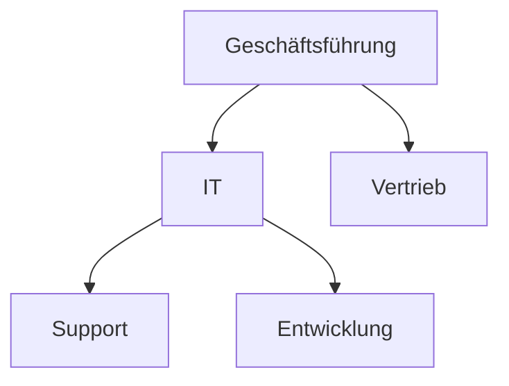

---
# Identity (stable; never change after publishing)
id: ap1-0348
slug: aufbauorganisation-definition

# Display
title: "Aufbauorganisation"

# Classification / navigation (machine-side)
module: "auftragsabwicklung-und-leistungserbringung"
topics: ["organisation", "unternehmensstruktur", "management"]
tags: ["aufbauorganisation", "hierarchie", "organigramm"]

# Flashcard payload
card:
  type: basic
  question: "Wie wird der Begriff Aufbauorganisation definiert?"
  answer: "Die Aufbauorganisation ist die hierarchische Struktur eines Unternehmens, die Aufgaben, Abteilungen, Leitungsebenen und Weisungsbeziehungen festlegt."
  examples: []

# Lifecycle
status: published       # draft | published | deprecated
created: "2026-03-28"
updated: "2026-03-28"
---

## Aufbauorganisation

Die Aufbauorganisation beschreibt die **Grundstruktur eines Unternehmens** und legt fest, wie Aufgaben und Verantwortlichkeiten verteilt sind.

## Kernerklärung
Die Aufbauorganisation ist die **hierarchische Gliederung eines Unternehmens**.

Sie bestimmt:

- **Aufgabenverteilung**
  - Welche Aufgaben gibt es und wer übernimmt sie?

- **Abteilungen**
  - Gliederung in Organisationseinheiten

- **Leitungsebenen**
  - Hierarchiestufen (z. B. Geschäftsführung → Abteilungen)

- **Weisungsbefugnisse**
  - Wer darf wem Anweisungen geben?

Die Darstellung erfolgt meist durch ein **Organigramm**.

### Organisationsformen
| Form                  | Beschreibung |
|----------------------|-------------|
| Einliniensystem      | Klare Weisungswege (eine Führungslinie) |
| Mehrliniensystem     | Mehrere Vorgesetzte möglich |
| Matrixorganisation   | Kombination aus mehreren Strukturen |

### Visualisierung (Beispiel)

## Praktisches Beispiel
Ein Unternehmen teilt sich in:

- Geschäftsführung  
- IT-Abteilung  
- Vertrieb  

Innerhalb der IT gibt es:

- Support  
- Entwicklung  

→ Die Aufbauorganisation zeigt, **wer zuständig ist und wer wem unterstellt ist**.

## Prüfungsrelevanz (AP1)
Sehr wichtiges Grundthema im Bereich **Organisation**.

### Typische Prüfungsfragen
- Was ist die Aufbauorganisation?
- Welche Elemente umfasst sie?
- Welche Organisationsformen gibt es?

### Antworten auf die typischen Prüfungsfragen
- Aufbauorganisation = hierarchische Struktur eines Unternehmens  
- Elemente:
  - Aufgaben
  - Abteilungen
  - Leitungsebenen
  - Weisungsbeziehungen  
- Formen:
  - Einlinien-, Mehrlinien-, Matrixorganisation  

## Merksatz
**Aufbauorganisation = Wer macht was, wer ist wem unterstellt**