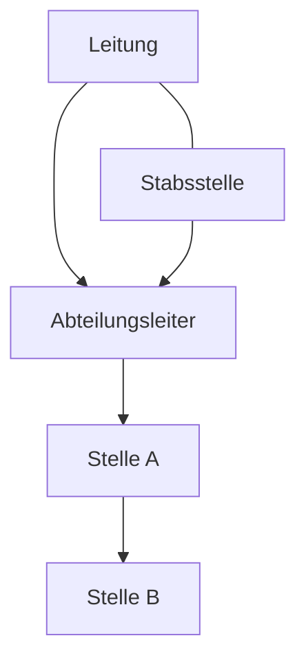

---
# Identity (stable; never change after publishing)
id: ap1-0350
slug: stabsstelle

# Display
title: "Stabsstelle"

# Classification / navigation (machine-side)
module: "auftragsabwicklung-und-leistungserbringung"
topics: ["organisation", "aufbauorganisation", "management"]
tags: ["stabsstelle", "stabliniensystem", "beratung"]

# Flashcard payload
card:
  type: basic
  question: "Was versteht man bei Aufbauorganisationen unter einer Stabsstelle?"
  answer: "Eine Stabsstelle unterstützt die Leitung bei Entscheidungsfindungen, hat aber keine eigene Weisungsbefugnis."
  examples: []

# Lifecycle
status: published       # draft | published | deprecated
created: "2026-03-28"
updated: "2026-03-28"
---

## Stabsstelle

Die Stabsstelle ist ein Element der Aufbauorganisation und dient der Unterstützung von Führungskräften.

## Kernerklärung
Eine **Stabsstelle**:

- ist einer **Leitung direkt zugeordnet**
- unterstützt bei:
  - Planung
  - Analyse
  - Entscheidungsfindung  
- hat **keine Weisungsbefugnis**
- trifft **keine eigenen Entscheidungen**

### Merkmale
- Beratende Funktion
- Entlastung der Führung
- Keine direkte Verantwortung für operative Aufgaben

### Einordnung im Stabliniensystem

## Praktisches Beispiel
Ein Unternehmen hat:

- Geschäftsführung  
- IT-Abteilung  

Zusätzlich gibt es eine **Stabsstelle für IT-Sicherheit**:

- analysiert Risiken  
- gibt Empfehlungen  
- trifft aber **keine Entscheidungen selbst**

## Prüfungsrelevanz (AP1)
Wichtig im Thema **Aufbauorganisation & Leitungssysteme**.

### Typische Prüfungsfragen
- Was ist eine Stabsstelle?
- Welche Aufgaben hat sie?
- Hat sie Weisungsbefugnis?

### Antworten auf die typischen Prüfungsfragen
- Stabsstelle = unterstützende Organisationseinheit  
- Aufgaben:
  - Beratung
  - Analyse
  - Vorbereitung von Entscheidungen  
- **Keine Weisungsbefugnis!**

## Merksatz
**Stabsstelle = beraten ja, entscheiden nein**