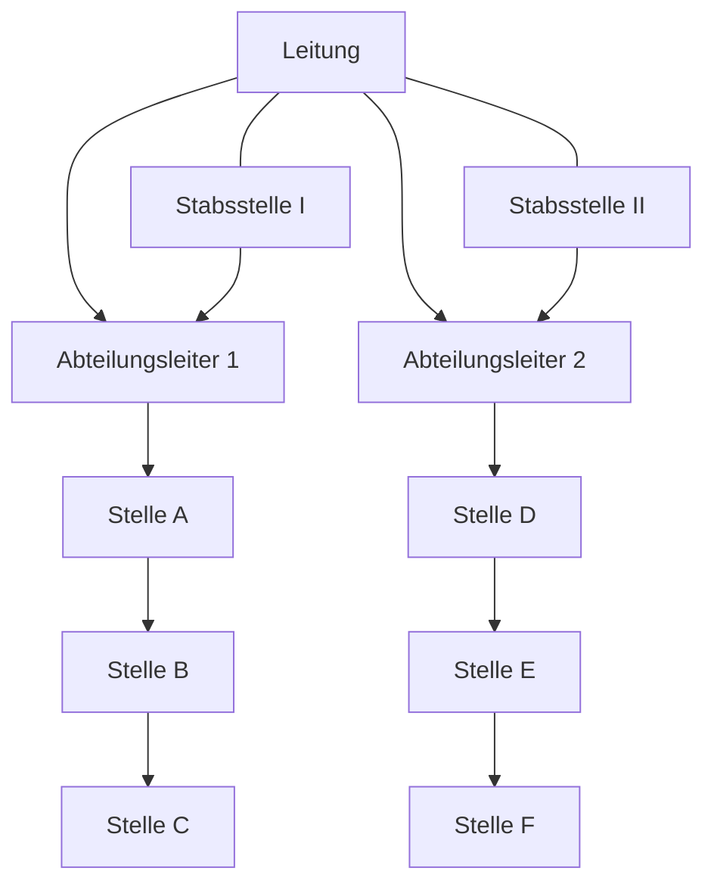

---
# Identity (stable; never change after publishing)
id: ap1-0351
slug: stabliniensystem

# Display
title: "Stabliniensystem"

# Classification / navigation (machine-side)
module: "auftragsabwicklung-und-leistungserbringung"
topics: ["organisation", "leitungssysteme", "management"]
tags: ["stabliniensystem", "stabsstelle", "einliniensystem"]

# Flashcard payload
card:
  type: basic
  question: "Beschreibe den Aufbau einer Stablinienorganisation."
  answer: "Das Stabliniensystem ist ein Einliniensystem, das durch Stabsstellen ergänzt wird, welche die Leitung unterstützen, aber keine Weisungsbefugnis haben."
  examples: []

# Lifecycle
status: published       # draft | published | deprecated
created: "2026-03-28"
updated: "2026-03-28"
---

## Stabliniensystem

Das Stabliniensystem kombiniert klare Hierarchien mit unterstützenden Beratungseinheiten.

## Kernerklärung
Das **Stabliniensystem** ist eine Erweiterung des Einliniensystems:

- **Einliniensystem bleibt bestehen**
  - Klare Weisungswege (eine Linie)

- **Ergänzung durch Stabsstellen**
  - Unterstützen die Leitung
  - Haben **keine Weisungsbefugnis**

### Aufgaben der Stabsstellen
- Beratung der Führung
- Vorbereitung von Entscheidungen
- Analyse und Planung

### Eigenschaften
- Klare Struktur + fachliche Unterstützung
- Entlastung der Führungskräfte
- Keine Konflikte durch Mehrfachunterstellung

### Visualisierung

## Praktisches Beispiel
Ein Unternehmen hat:

- Klare Hierarchie (Geschäftsführung → Abteilungen → Mitarbeiter)
- Zusätzlich:
  - **Stabsstelle Recht**
  - **Stabsstelle IT-Sicherheit**

Diese:

- beraten die Führung  
- unterstützen Abteilungen  
- treffen aber **keine eigenen Entscheidungen**

## Prüfungsrelevanz (AP1)
Sehr wichtig für das Verständnis von **Leitungssystemen**.

### Typische Prüfungsfragen
- Was ist ein Stabliniensystem?
- Welche Rolle haben Stabsstellen?
- Unterschied zum Mehrliniensystem?

### Antworten auf die typischen Prüfungsfragen
- Stabliniensystem = Einliniensystem + Stabsstellen  
- Stabsstellen:
  - beratend
  - keine Weisungsbefugnis  
- Unterschied:
  - Mehrliniensystem → mehrere Vorgesetzte  
  - Stabliniensystem → klare Linie + Unterstützung  

## Merksatz
**Stabliniensystem = klare Linie + beratende Stabsstellen**