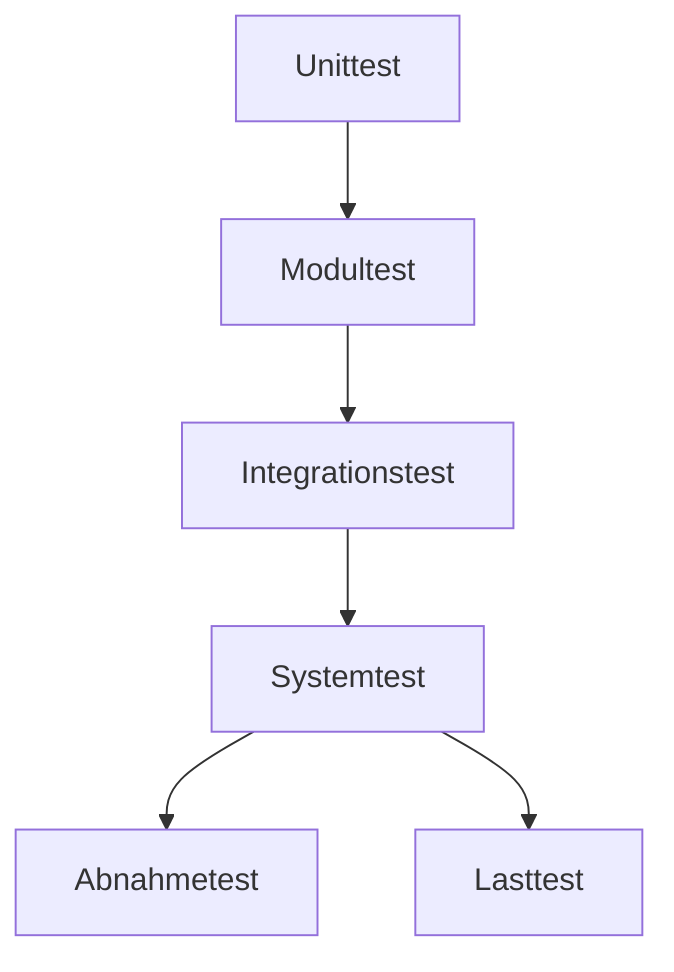

---
# Identity (stable; never change after publishing)
id: ap1-0358
slug: testverfahren-softwareentwicklung

# Display
title: "Testverfahren in der Anwendungsentwicklung"

# Classification / navigation (machine-side)
module: "auftragsabwicklung-und-leistungserbringung"
topics: ["softwareentwicklung", "testen"]
tags: ["tests", "unit-test", "integrationstest", "blackbox", "whitebox"]

# Flashcard payload
card:
  type: basic
  question: "Welche Testverfahren gibt es in der Anwendungsentwicklung?"
  answer: "Zu den Testverfahren gehören Black-Box- und White-Box-Tests sowie Unit-, Modul-, Integrations-, System-, Abnahme- und Lasttests."
  examples: []

# Lifecycle
status: published       # draft | published | deprecated
created: "2026-03-29"
updated: "2026-03-29"
---

## Testverfahren in der Anwendungsentwicklung

Testverfahren dienen dazu, **Software systematisch auf Fehler zu prüfen** und die Qualität sicherzustellen.

## Kernerklärung

In der Anwendungsentwicklung gibt es verschiedene Testarten, die sich in **Testtiefe und Ziel** unterscheiden.

### Testarten aus der Karte

- **Black-Box-Test**
  - Test ohne Kenntnis des Codes
  - Fokus: Eingaben und Ausgaben

- **White-Box-Test**
  - Test mit Kenntnis des Codes
  - Fokus: interne Logik und Programmstruktur

---

### Teststufen

| Teststufe         | Ziel |
|------------------|------|
| Unittest          | kleinste Einheit (z. B. Funktion) testen |
| Modultest         | mehrere zusammengehörige Funktionen |
| Integrationstest  | Zusammenspiel von Modulen |
| Systemtest        | gesamtes System testen |
| Abnahmetest       | Prüfung durch den Kunden |
| Lasttest          | Verhalten unter hoher Belastung |

---

### Zusammenhang der Tests

Tests bauen aufeinander auf:  
von **klein (Code)** → zu **groß (Gesamtsystem)**

## Praktisches Beispiel

- Entwickler testet einzelne Funktion → **Unittest**
- Mehrere Module werden zusammen getestet → **Integrationstest**
- Kunde prüft fertige Software → **Abnahmetest**
- System wird mit vielen Nutzern belastet → **Lasttest**

## Prüfungsrelevanz (AP1)

### Typische Prüfungsfragen
- Nenne Testverfahren.
- Unterschied Black-Box / White-Box?
- Reihenfolge der Teststufen?

### Antworten auf die typischen Prüfungsfragen
- Black-Box, White-Box, Unit-, Modul-, Integrations-, System-, Abnahme-, Lasttest  
- Black-Box = ohne Codewissen, White-Box = mit Codewissen  
- Reihenfolge: klein → groß (Unit → System)  

## Merksatz

**Teste klein → dann größer → dann komplett (vom Code bis zum Kunden)**