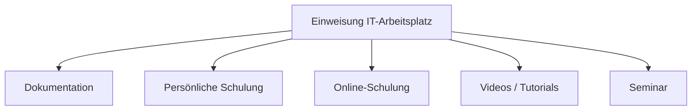

---
# Identity (stable; never change after publishing)
id: ap1-0363
slug: einweisung-it-arbeitsplatz-methoden

# Display
title: "Einweisung in einen IT-Arbeitsplatz – Methoden"

# Classification / navigation (machine-side)
module: "auftragsabwicklung-und-leistungserbringung"
topics: ["kundenschulung", "einweisung"]
tags: ["schulung", "dokumentation", "it-arbeitsplatz"]

# Flashcard payload
card:
  type: basic
  question: "Welche 3 Methoden gibt es, um einen Kunden oder eine Kundin am IT-Arbeitsplatz einzuweisen?"
  answer: "Handbücher/Dokumentationen, persönliche Schulung durch IT-Fachpersonal sowie Online-Schulungen (Webportale), Videos oder Tutorials."
  examples: []

# Lifecycle
status: published       # draft | published | deprecated
created: "2026-03-29"
updated: "2026-03-29"
---

## Einweisung in einen IT-Arbeitsplatz – Methoden

Zur Nutzung eines IT-Arbeitsplatzes muss der Kunde **systematisch eingewiesen werden**.

Ziel: sichere, effiziente und selbstständige Nutzung  

---

## Kernerklärung

Typische Methoden zur Einweisung:

### 1. Handbücher und Dokumentationen
- erklären Funktionen und Nutzung
- dienen als Nachschlagewerk
- unterstützen eigenständiges Lernen

---

### 2. Persönliche Schulung durch IT-Fachpersonal
- direkte Erklärung der Funktionen
- individuell oder in Gruppen möglich
- Rückfragen direkt klärbar

---

### 3. Online-Schulung (Webportale / virtuelle Schulungen)
- Teilnahme ortsunabhängig
- Trainer kann individuell auf Fragen eingehen
- geeignet für verteilte Kunden

---

### 4. Online Videos oder Tutorials
- Schritt-für-Schritt-Anleitungen
- jederzeit verfügbar
- ideal zur Wiederholung

---

### 5. Seminar (Gruppenschulung)
- mehrere Teilnehmer gleichzeitig
- praktische Übungen in Testumgebung
- strukturiertes Lernen

---

### Vergleich der Methoden

| Methode                | Vorteil                          | Nachteil                      |
|------------------------|----------------------------------|-------------------------------|
| Dokumentation          | jederzeit verfügbar              | keine direkte Hilfe           |
| Persönliche Schulung   | individuell, direktes Feedback   | zeitaufwendig                 |
| Online-Schulung        | ortsunabhängig                   | technische Voraussetzungen    |
| Videos/Tutorials       | flexibel, wiederholbar           | keine Interaktion             |
| Seminar                | strukturiert, praxisnah          | weniger individuell           |

---

### Zusammenhang

---

## Praktisches Beispiel

Ein Unternehmen führt neue Software ein:

- Mitarbeiter erhalten **Handbuch**
- IT-Team führt **Schulung vor Ort** durch
- Ergänzend stehen **Videos im Intranet** bereit  

Kombination erhöht Lernerfolg

---

## Prüfungsrelevanz (AP1)

### Typische Prüfungsfragen
- Nenne Methoden zur Einweisung
- Welche Methode ist wann sinnvoll?
- Was sind Vorteile/Nachteile?

### Antworten auf die typischen Prüfungsfragen
- Dokumentation, persönliche Schulung, Online-Angebote, Tutorials  
- Wahl abhängig von Aufwand, Zielgruppe und Komplexität  
- Kombination ist meist optimal  

---

## Merksatz

**Gute Einweisung = erklären + zeigen + üben + nachschlagen können**