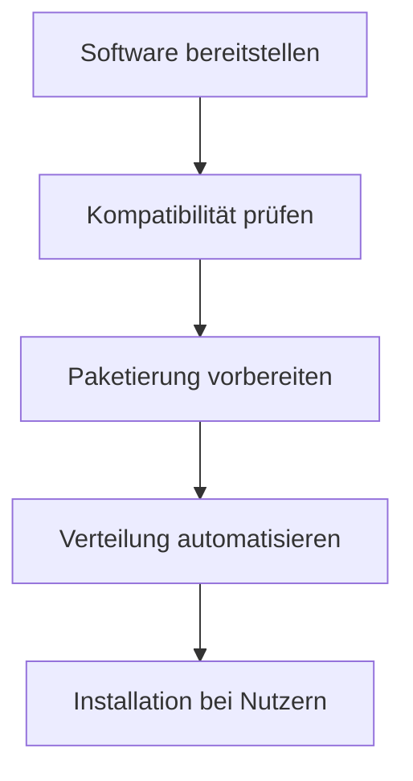

---
# Identity (stable; never change after publishing)
id: ap1-0366
slug: software-rollout-prozesse

# Display
title: "Software-Rollout Prozesse"

# Classification / navigation (machine-side)
module: "auftragsabwicklung-und-leistungserbringung"
topics: ["softwareverteilung", "rollout"]
tags: ["software-rollout", "deployment", "verteilung"]

# Flashcard payload
card:
  type: basic
  question: "Was ist bei einem Software-Rollout zu beachten?"
  answer: "Beim Software-Rollout müssen die Software veröffentlicht, auf Kompatibilität geprüft sowie für die automatische Verteilung (z. B. per Paketierung und Verteilungssoftware) vorbereitet werden."
  examples: []

# Lifecycle
status: published       # draft | published | deprecated
created: "2026-03-29"
updated: "2026-03-29"
---

## Software-Rollout Prozesse

Ein **Software-Rollout** beschreibt die strukturierte **Verteilung neuer Software** im Unternehmen.

-> Ziel: sichere, effiziente und automatisierte Installation

---

## Kernerklärung

Beim Software-Rollout sind mehrere Schritte notwendig:

- **Prüfung der Kompatibilität**
  - Funktioniert die Software auf vorhandener Hardware?

- **Vorbereitung der Software**
  - Installation oder Update wird vorbereitet
  - ggf. Erstellung eines Installationspakets

- **Automatisierte Verteilung**
  - Einsatz von **Paketierungssoftware**
  - Nutzung von **Verteilungssoftware (Deployment-Tools)**

- **Veröffentlichung (Deployment)**
  - Software wird im Unternehmen bereitgestellt

---

### Ablauf eines Software-Rollouts

---

## Praktisches Beispiel

Ein Unternehmen führt eine neue Office-Software ein:

- Software wird getestet (Kompatibilität)  
- Installationspaket wird erstellt  
- Verteilung erfolgt automatisch über ein Tool  
- Mitarbeitende erhalten die Software ohne manuelle Installation  

-> Effizienter und standardisierter Rollout

---

## Prüfungsrelevanz (AP1)

### Typische Prüfungsfragen
- Welche Schritte gehören zu einem Software-Rollout?
- Warum ist Paketierung wichtig?
- Was bedeutet Deployment?

### Antworten auf die typischen Prüfungsfragen
- Prüfung, Vorbereitung, Verteilung und Veröffentlichung  
- Paketierung ermöglicht automatisierte Installation  
- Deployment = Bereitstellung/Veröffentlichung von Software  

---

## Merksatz

**Software-Rollout = Prüfen → Vorbereiten → Verteilen → Installieren**