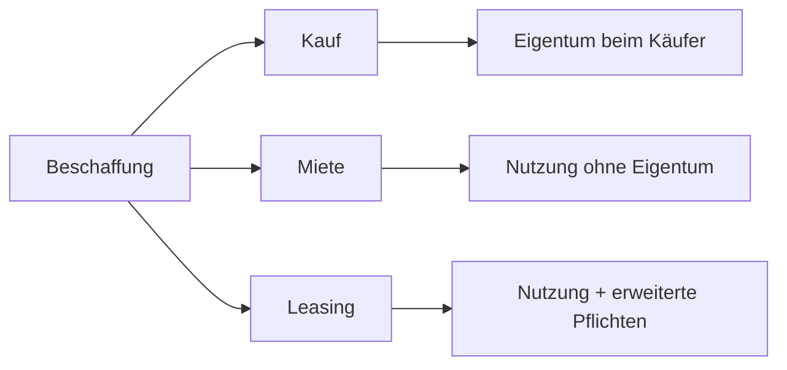

---
# Identity (stable; never change after publishing)
id: ap1-0368
slug: kauf-miete-leasing-unterschiede

# Display
title: "Unterschiede: Kauf, Miete und Leasing"

# Classification / navigation (machine-side)
module: "auftragsabwicklung-und-leistungserbringung"
topics: ["beschaffung", "verträge"]
tags: ["kauf", "miete", "leasing", "wirtschaft"]

# Flashcard payload
card:
  type: comparison
  question: "Wie unterscheiden sich Kauf, Miete und Leasing voneinander?"
  answer: "Kauf: Eigentum geht auf den Käufer über. Miete: Nutzung gegen Zahlung, Eigentum bleibt beim Vermieter. Leasing: ähnliche Nutzung wie Miete, aber mit erweiterten Rechten/Pflichten und oft wirtschaftlicher Eigentumsübertragung während der Laufzeit."
  examples: []

# Lifecycle
status: published       # draft | published | deprecated
created: "2026-03-29"
updated: "2026-03-29"
---

## Kauf, Miete und Leasing: Unterschiede

Die drei Modelle unterscheiden sich darin, **wer Eigentümer ist** und **wer Risiken sowie Pflichten trägt**.

-> Wichtig für Beschaffung von IT-Hardware und Software

---

## Kernerklärung

| Merkmal | Kauf | Miete | Leasing |
|--------|------|-------|---------|
| Eigentum | Käufer wird Eigentümer | Vermieter bleibt Eigentümer | Leasinggeber bleibt Eigentümer |
| Nutzung | uneingeschränkt | zeitlich begrenzt | zeitlich begrenzt |
| Zahlung | einmalig (Kaufpreis) | regelmäßige Miete | regelmäßige Leasingrate |
| Risiken | Käufer trägt Risiko | Vermieter trägt Risiko | meist Leasingnehmer trägt viele Risiken |
| Wartung | Käufer verantwortlich | oft Vermieter | oft Leasingnehmer (je nach Vertrag) |

---

### Details

- **Kauf**
  - Eigentum geht vollständig auf Käufer über
  - Einmalige Zahlung

- **Miete**
  - Nutzung gegen regelmäßige Zahlung
  - Eigentum bleibt beim Vermieter

- **Leasing**
  - Sonderform der Miete
  - Leasingnehmer übernimmt oft:
    - Wartung
    - Risiken
  - Objekt bleibt rechtlich beim Leasinggeber

---

### Zusammenhang

---

## Praktisches Beispiel

Ein Unternehmen benötigt neue Laptops:

- **Kauf**: Laptops gehören dem Unternehmen  
- **Miete**: Geräte werden genutzt, aber nicht besessen  
- **Leasing**: Nutzung + Wartungspflichten beim Unternehmen  

-> Entscheidung abhängig von Budget und Flexibilität

---

## Prüfungsrelevanz (AP1)

### Typische Prüfungsfragen
- Unterschied zwischen Kauf, Miete und Leasing?
- Wer ist Eigentümer bei Leasing?
- Wer trägt Risiken?

### Antworten auf die typischen Prüfungsfragen
- Kauf = Eigentum, Miete = Nutzung, Leasing = Nutzung mit erweiterten Pflichten  
- Leasinggeber bleibt Eigentümer  
- Risiken meist beim Käufer bzw. Leasingnehmer  

---

## Merksatz

**Kauf = besitzen, Miete = nutzen, Leasing = nutzen + Verantwortung**