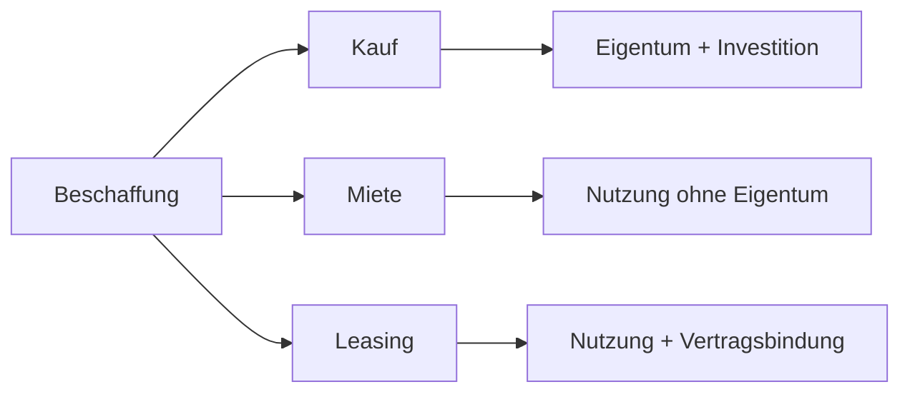

---
# Identity (stable; never change after publishing)
id: ap1-0369
slug: kauf-it-hardware-vor-und-nachteile

# Display
title: "Vor- und Nachteile beim Kauf von IT-Hardware"

# Classification / navigation (machine-side)
module: "auftragsabwicklung-und-leistungserbringung"
topics: ["beschaffung", "hardware"]
tags: ["kauf", "vorteile", "nachteile", "it-hardware"]

# Flashcard payload
card:
  type: basic
  question: "Was sind die Vor- und Nachteile beim Kauf von IT-Hardware für Unternehmen?"
  answer: "Vorteile: sofortiges Eigentum, volle Verfügungsgewalt, keine Laufzeitbindung, Wiederverkauf möglich. Nachteile: hohe Kapitalbindung, geringere Liquidität und Risiko der schnellen Veralterung."
  examples: []

# Lifecycle
status: published       # draft | published | deprecated
created: "2026-03-29"
updated: "2026-03-29"
---

## Vor- und Nachteile beim Kauf von IT-Hardware

Beim **Kauf von IT-Hardware** wird das Unternehmen sofort **Eigentümer** der Geräte.

-> Entscheidung zwischen **Investition vs. Flexibilität**

---

## Kernerklärung

### Vorteile beim Kauf

- **Sofortiges Eigentum**
  - juristisch und wirtschaftlich gehört die Hardware dem Unternehmen

- **Volle Verfügungsgewalt**
  - Nutzung, Anpassung und Einsatz frei bestimmbar

- **Keine Laufzeitbindung**
  - keine vertraglichen Einschränkungen wie bei Miete/Leasing

- **Wiederverkauf möglich**
  - Hardware kann jederzeit verkauft werden

- **Steuerliche Vorteile**
  - als Betriebsausgabe abschreibbar

---

### Nachteile beim Kauf

- **Hohe Kapitalbindung**
  - viel Geld wird auf einmal investiert

- **Geringere Liquidität**
  - weniger finanzielle Flexibilität im Unternehmen

- **Schnelle Veralterung**
  - IT-Hardware wird schnell technisch überholt

---

### Vergleich (Kurzüberblick)

| Vorteil | Nachteil |
|--------|---------|
| Eigentum | Kapitalbindung |
| volle Kontrolle | Liquiditätsverlust |
| flexibel nutzbar | technisches Risiko |

---

### Einordnung im Beschaffungsprozess

---

## Praktisches Beispiel

Ein Unternehmen kauft neue Server:

- hohe einmalige Kosten  
- volle Kontrolle über Nutzung  
- späterer Weiterverkauf möglich  

-> sinnvoll bei langfristiger Nutzung

---

## Prüfungsrelevanz (AP1)

### Typische Prüfungsfragen
- Nenne Vorteile des Kaufs von IT-Hardware
- Welche Nachteile entstehen beim Kauf?
- Wann ist Kauf sinnvoll?

### Antworten auf die typischen Prüfungsfragen
- Eigentum, Kontrolle, keine Bindung  
- Kapitalbindung, geringere Liquidität, Veralterung  
- bei langfristiger Nutzung und ausreichendem Budget  

---

## Merksatz

**Kauf = volle Kontrolle, aber hohe Kosten und Risiko der Veralterung**