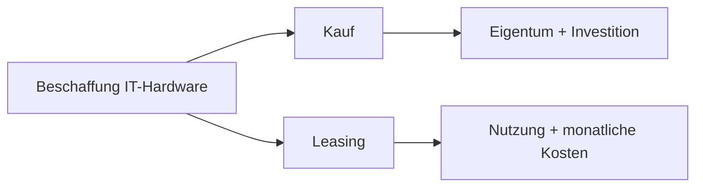

---
# Identity (stable; never change after publishing)
id: ap1-0370
slug: leasing-it-hardware-vor-und-nachteile

# Display
title: "Vor- und Nachteile von Leasing bei IT-Hardware"

# Classification / navigation (machine-side)
module: "auftragsabwicklung-und-leistungserbringung"
topics: ["beschaffung", "leasing"]
tags: ["leasing", "it-hardware", "vorteile", "nachteile"]

# Flashcard payload
card:
  type: basic
  question: "Was sind die Vor- und Nachteile für ein Unternehmen beim Leasing von IT-Hardware?"
  answer: "Vorteile: keine hohe Anfangsinvestition, planbare Raten, bilanzneutral, oft Wartung durch Anbieter, stets aktuelle Technik. Nachteile: kein Eigentum, feste Laufzeiten, meist nicht kündbar, insgesamt oft höhere Kosten."
  examples: []

# Lifecycle
status: published       # draft | published | deprecated
created: "2026-03-29"
updated: "2026-03-29"
---

## Vor- und Nachteile von Leasing bei IT-Hardware

Beim **Leasing von IT-Hardware** nutzt ein Unternehmen Geräte gegen **regelmäßige Zahlungen**, ohne Eigentümer zu werden.

-> Fokus: **Liquidität und Flexibilität statt Besitz**

---

## Kernerklärung

### Vorteile beim Leasing

- **Keine hohe Anfangsinvestition**
  - Form der Fremdfinanzierung

- **Schonung der Liquidität**
  - keine sofortige große Ausgabe

- **Planbare Kosten**
  - feste monatliche Raten

- **Bilanzneutralität**
  - Objekt gehört nicht zum Anlagevermögen

- **Service durch Anbieter**
  - Wartung/Reparatur oft durch Leasinggeber

- **Immer aktuelle Technik**
  - regelmäßiger Austausch möglich

---

### Nachteile beim Leasing

- **Kein Eigentum**
  - Hardware bleibt beim Leasinggeber

- **Feste Vertragslaufzeit**
  - meist 1–5 Jahre

- **Geringe Flexibilität**
  - oft nicht kündbar

- **Höhere Gesamtkosten**
  - über Laufzeit meist teurer als Kauf

---

### Vergleich zum Kauf (Kurz)

| Leasing | Kauf |
|--------|------|
| geringe Anfangskosten | hohe Einmalzahlung |
| kein Eigentum | Eigentum |
| planbare Raten | keine laufenden Raten |
| flexibel bzgl. Technik | Risiko der Veralterung |

---

### Einordnung

---

## Praktisches Beispiel

Ein Unternehmen least Laptops:

- zahlt monatliche Raten  
- bekommt Wartung inklusive  
- tauscht Geräte nach 3 Jahren gegen neue  

-> ideal bei schnellem Technologiewandel

---

## Prüfungsrelevanz (AP1)

### Typische Prüfungsfragen
- Vorteile von Leasing?
- Nachteile von Leasing?
- Unterschied zu Kauf?

### Antworten auf die typischen Prüfungsfragen
- geringe Anfangskosten, planbare Raten, aktuelle Technik  
- kein Eigentum, Vertragsbindung, höhere Gesamtkosten  
- Leasing = Nutzung, Kauf = Eigentum  

---

## Merksatz

**Leasing = nutzen ohne zu besitzen, dafür flexibel und planbar – aber langfristig teurer**