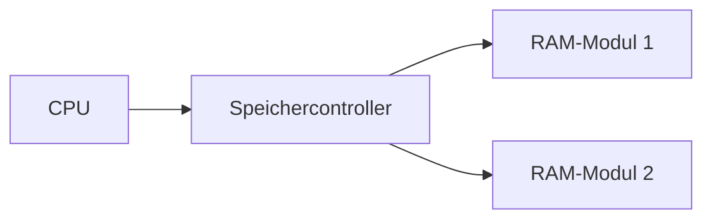

---
# Identity (stable; never change after publishing)
id: ap1-0058
slug: dual-channel-ram-vorteil

# Display
title: "Dual-Channel-Technik bei RAM"

# Classification / navigation (machine-side)
module: "it-systeme"
topics: ["Hardware", "Arbeitsspeicher"]
tags: ["prüfungsrelevant", "definition"]

# Flashcard payload
card:
  type: basic
  question: "Welchen Vorteil bringt der Einsatz von Dual-Channel-Technik bei Speichermodulen?"
  answer: "Die Dual-Channel-Technik ermöglicht es dem Speichercontroller, Daten gleichzeitig über zwei Arbeitsspeichermodule zu übertragen. Dadurch können Daten parallel gelesen und geschrieben werden, wodurch sich die verfügbare Speicherbandbreite und damit die Datenrate erhöht."
  examples:
    - "2 identische RAM-Module ermöglichen Dual-Channel-Betrieb."
    - "Die Speicherbandbreite kann sich im Idealfall nahezu verdoppeln."

# Lifecycle
status: draft
created: "2026-03-11"
updated: "2026-03-11"
---

## Dual-Channel-Technik bei RAM

Die **Dual-Channel-Technik** ist eine Speicherarchitektur, bei der der **Speichercontroller gleichzeitig auf zwei RAM-Module zugreifen kann**.

Dadurch können Daten **parallel übertragen** werden, was die **Speicherbandbreite deutlich erhöht**.

---

## Funktionsprinzip

Bei Single-Channel:

- Zugriff über **einen Speicherkanal**

Bei Dual-Channel:

- Zugriff über **zwei parallele Speicherkanäle**

Der Speichercontroller kann Daten **gleichzeitig auf beide Module verteilen** und parallel lesen oder schreiben.

---

## Voraussetzungen für Dual-Channel

Damit Dual-Channel optimal funktioniert, sollten:

- **zwei Speichermodule verwendet werden**
- die Module **baugleich sein**
- sie **die gleiche Kapazität besitzen**
- sie **paarweise in die vorgesehenen Slots eingesetzt werden**

---

## Vorteil der Technik

| Eigenschaft | Wirkung |
|---|---|
| Parallele Datenübertragung | höhere Speicherbandbreite |
| gleichzeitiges Lesen/Schreiben | bessere Systemleistung |
| effizientere CPU-Auslastung | schnellere Datenverarbeitung |

Im Idealfall kann sich die **Speicherbandbreite nahezu verdoppeln**.

---

## Beispiel

Ein System mit:

- **1 RAM-Modul (Single-Channel)** → geringere Speicherbandbreite

Ein System mit:

- **2 identischen RAM-Modulen (Dual-Channel)** → höhere Speicherbandbreite

Dadurch können Programme schneller auf Daten im Arbeitsspeicher zugreifen.

---

## Prüfungsrelevanz (IHK / AP1)

Typische Prüfungsfragen:

- Vorteil von **Dual-Channel-RAM**
- Voraussetzungen für **Dual-Channel-Betrieb**
- Unterschied zwischen **Single-Channel und Dual-Channel**

**Merksatz**

> Dual-Channel verdoppelt die Speicherkanäle und erhöht dadurch die mögliche Datenübertragungsrate zwischen CPU und Arbeitsspeicher.

---

## Wichtiger Hinweis

Dual-Channel **verdoppelt nicht automatisch die Gesamtleistung des Systems**, sondern hauptsächlich die **Speicherbandbreite**.

Der tatsächliche Leistungsgewinn hängt von der **Anwendung und der CPU-Architektur** ab.

---