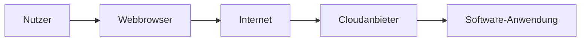
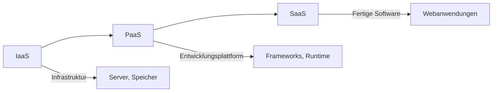

---
# Identity (stable; never change after publishing)
id: ap1-0068
slug: saas

# Display
title: "Software as a Service (SaaS)"

# Classification / navigation (machine-side)
module: "it-systeme"
topics: ["Cloud Computing", "Servicemodelle"]
tags: ["prüfungsrelevant", "definition", "cloud"]

# Flashcard payload
card:
  type: definition
  question: "Erkläre den Cloud-Computing-Begriff Software as a Service (SaaS)."
  answer: "Software as a Service (SaaS) ist ein Cloud-Servicemodell, bei dem Anwendungen nicht lokal installiert werden, sondern über das Internet als Dienst bereitgestellt und meist über einen Webbrowser genutzt werden."
  examples:
    - "Microsoft 365"
    - "Google Workspace"
    - "Salesforce"

# Lifecycle
status: draft
created: "2026-03-12"
updated: "2026-03-12"
---

## Software as a Service (SaaS)

**Software as a Service (SaaS)** beschreibt ein Cloud-Konzept, bei dem **Software nicht mehr als klassische Lizenz installiert wird**, sondern **als Dienst aus der Cloud bereitgestellt wird**.

Der Nutzer greift dabei über das **Internet** auf die Anwendung zu.

Häufig erfolgt der Zugriff über:

- **Webbrowser**
- **Webanwendungen**
- **Cloud-Clients**

Der Anbieter betreibt dabei die komplette Infrastruktur und Software.

---

## Funktionsprinzip

Der Benutzer benötigt nur:

- Internetzugang
- Browser oder Client

Die gesamte Software läuft beim **Cloud-Anbieter**.

---

## Verantwortungsverteilung

| Bereich | Verantwortlich |
|---|---|
| Hardware | Cloud-Anbieter |
| Infrastruktur | Cloud-Anbieter |
| Plattform | Cloud-Anbieter |
| Anwendung | Cloud-Anbieter |
| Nutzung / Daten | Kunde |

Der Nutzer verwendet lediglich die Anwendung.

---

## Beispiel aus der Praxis

Ein Unternehmen nutzt **Microsoft 365**:

- Keine lokale Installation von Office nötig  
- Zugriff über Browser oder Cloud-App  
- Updates erfolgen automatisch durch den Anbieter  

---

## Einordnung der Cloud-Servicemodelle

---

## Prüfungsrelevanz (AP1)

Typische Fragen:

- Definition von **SaaS**
- Unterschiede zwischen **IaaS, PaaS und SaaS**
- Beispiele für **Cloud-Anwendungen**

**Merksatz**

> Bei **SaaS** nutzt der Anwender fertige Software aus der Cloud, ohne sich um Installation, Wartung oder Infrastruktur kümmern zu müssen.

---