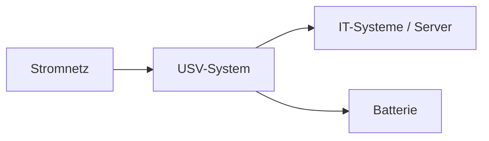

---
# Identity (stable; never change after publishing)
id: ap1-0071
slug: usv-aufgaben

# Display
title: "Aufgaben einer USV"

# Classification / navigation (machine-side)
module: "it-systeme"
topics: ["Hardware", "Stromversorgung", "Verfügbarkeit"]
tags: ["prüfungsrelevant", "definition"]

# Flashcard payload
card:
  type: definition
  question: "IT-Infrastrukturen werden heute 24/7 (24 Stunden pro Tag, 7 Tage die Woche) betrieben. Welche Aufgabe übernimmt in diesem Zusammenhang eine USV?"
  answer: |
    Eine **unterbrechungsfreie Stromversorgung (USV)** stellt die Stromversorgung kritischer IT-Komponenten bei Störungen im Stromnetz kurzfristig sicher.

    Sie schützt – je nach Typ – zusätzlich vor:
    - Stromausfall
    - Unterspannung
    - Überspannung
    - Frequenzabweichungen
    - Oberschwingungen
  examples:
    - "Ein Server bleibt bei Stromausfall noch kurz aktiv und kann kontrolliert herunterfahren."
    - "Switches und Firewalls bleiben bei kurzen Spannungseinbrüchen weiterhin in Betrieb."
    - "Spannungsspitzen werden von der USV abgefangen."

# Lifecycle
status: draft
created: "2026-03-12"
updated: "2026-03-12"
---

## Aufgabe einer USV

Eine **Unterbrechungsfreie Stromversorgung (USV)** schützt IT-Systeme vor Problemen in der Stromversorgung, z. B.:

- Stromausfall  
- Unterspannung  
- Überspannung  
- Frequenzabweichungen  
- Oberschwingungen  

Sie stellt sicher, dass **kritische Systeme kurzfristig weiter mit Strom versorgt werden**.

---

## Zweck im 24/7-Betrieb

Viele IT-Systeme laufen **rund um die Uhr**.  
Ein plötzlicher Stromausfall kann deshalb zu Problemen führen:

- Server fahren unerwartet herunter  
- Daten können verloren gehen  
- Datenbanken oder Dateisysteme können beschädigt werden  
- Netzwerkdienste fallen aus  

Eine **USV überbrückt diese Zeit**, sodass Systeme **weiterlaufen oder kontrolliert heruntergefahren werden können**.

---

## Funktionsprinzip

Bei einer **Störung im Stromnetz** übernimmt die **Batterie der USV** kurzfristig die Versorgung der angeschlossenen Geräte.

---

## Prüfungsrelevanz (AP1)

### Frage: Aufgabe einer USV erklären

Eine **USV stellt die Stromversorgung kritischer IT-Systeme bei Stromstörungen kurzfristig sicher**, damit Systeme weiterlaufen oder kontrolliert heruntergefahren werden können.

---

### Frage: Schutzfunktionen einer USV nennen

Je nach Typ schützt eine USV vor:

- Stromausfall  
- Unterspannung  
- Überspannung  
- Frequenzabweichungen  
- Oberschwingungen  

---

### Frage: Zusammenhang zwischen USV und Hochverfügbarkeit erklären

Viele IT-Systeme müssen **24/7 verfügbar sein**.  
Eine USV verhindert, dass Systeme bei kurzen Stromausfällen sofort abschalten und ermöglicht:

- kurzfristigen Weiterbetrieb  
- kontrolliertes Herunterfahren  
- Schutz vor Datenverlust  

---

**Merksatz**

> Eine USV sichert bei Stromproblemen kurzfristig die Stromversorgung kritischer IT-Systeme und schützt sie vor Netzstörungen.