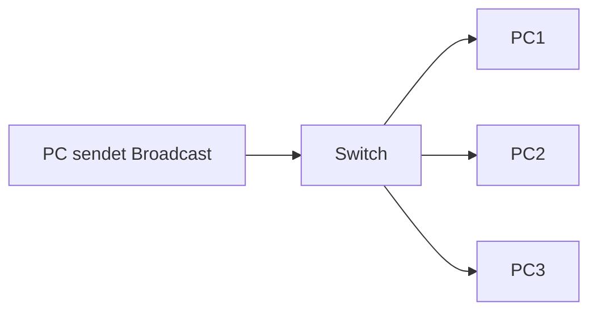

---
# Identity (stable; never change after publishing)
id: ap1-0077
slug: "broadcast-domain"

# Display
title: "Broadcast-Domäne"

# Classification / navigation (machine-side)
module: "Beurteilen marktgängiger IT-Systeme und Lösungen"
topics: ["Netzwerke"]
tags: ["definition","prüfungsrelevant"]

# Flashcard payload
card:
  type: definition
  question: "Was ist eine Broadcast-Domäne?"
  answer: "Eine Broadcast-Domäne ist ein Netzwerkbereich, in dem ein Broadcast-Paket von allen Geräten empfangen wird."
  examples:
    - "In einem einfachen LAN ohne Router befinden sich alle Geräte in derselben Broadcast-Domäne."
    - "Ein Router trennt verschiedene Broadcast-Domänen."
    - "VLANs können Broadcast-Domänen logisch voneinander trennen."

# Lifecycle
status: draft
created: "2026-03-14"
updated: "2026-03-14"
---

<!-- Optional: extra explanation, diagrams, tables, links, etc.
     Keep the "answer" concise; put longer context here if useful. -->

## Broadcast-Domäne

Eine **Broadcast-Domäne** bezeichnet einen Bereich eines Netzwerks, in dem **Broadcast-Nachrichten an alle Teilnehmer gesendet werden**.

Broadcasts werden verwendet, wenn ein Gerät **alle Geräte im selben Netzwerksegment erreichen möchte**.

---

## Kernerklärung

In einer Broadcast-Domäne erhalten **alle Geräte im gleichen Netzwerksegment** eine Broadcast-Nachricht.

Typische Eigenschaften:

- Broadcast-Pakete werden an **alle Geräte im Segment verteilt**
- Broadcast-Adresse im Ethernet: **FF:FF:FF:FF:FF:FF**
- Broadcasts werden häufig für **Adress- oder Dienstanfragen** verwendet

### Verhalten verschiedener Netzwerkgeräte

| Gerät | Einfluss auf Broadcast-Domänen |
|---|---|
| Hub | Leitet Broadcasts an alle Ports weiter |
| Switch | Leitet Broadcasts innerhalb derselben Broadcast-Domäne weiter |
| Router | Trennt Broadcast-Domänen |
| VLAN | Kann Broadcast-Domänen logisch trennen |

Wichtige Punkte:

- **Switches trennen Kollisionsdomänen**, aber nicht Broadcast-Domänen  
- **Router oder Layer-3-Geräte trennen Broadcast-Domänen**

---

## Praktisches Beispiel

In einem kleinen Büro sind mehrere Computer an einen Switch angeschlossen.

Wenn ein Computer eine **ARP-Anfrage** sendet:

1. Der Computer sendet ein Broadcast-Paket.
2. Der Switch verteilt dieses Paket an alle Ports.
3. Alle Geräte im Netzwerk erhalten die Anfrage.
4. Nur das richtige Zielgerät antwortet.

---

## Prüfungsrelevanz (AP1)

### Typische Prüfungsfragen

- Was ist eine Broadcast-Domäne?
- Welche Geräte trennen Broadcast-Domänen?
- Welche Geräte leiten Broadcasts weiter?

### Antworten auf die typischen Prüfungsfragen

**Broadcast-Domäne**

Eine Broadcast-Domäne ist ein Netzwerkbereich, in dem **alle Geräte Broadcast-Pakete empfangen**.

**Geräte, die Broadcast-Domänen trennen**

- Router  
- Layer-3-Switch  
- VLAN-Konfigurationen

**Geräte, die Broadcasts weiterleiten**

- Hubs  
- Switches (innerhalb derselben Broadcast-Domäne)

---

## Merksatz

> Eine Broadcast-Domäne umfasst alle Geräte, die einen Broadcast empfangen können – getrennt wird sie typischerweise durch Router oder VLANs.