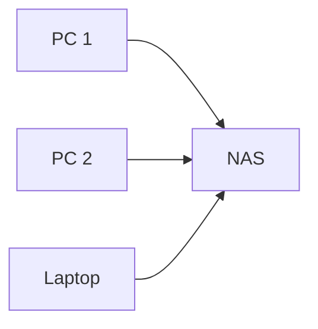

---
# Identity (stable; never change after publishing)
id: ap1-0078
slug: "network-attached-storage"

# Display
title: "Network Attached Storage (NAS)"

# Classification / navigation (machine-side)
module: "Beurteilen marktgängiger IT-Systeme und Lösungen"
topics: ["Speicherlösungen", "Netzwerke"]
tags: ["definition", "prüfungsrelevant"]

# Flashcard payload
card:
  type: definition
  question: "Was ist ein Network Attached Storage (NAS)?"
  answer: "Ein Network Attached Storage (NAS) ist ein netzgebundener Dateiserver, der zentralen Speicher im Netzwerk bereitstellt."
  examples:
    - "Ein NAS dient als zentraler Speicher für Backups im Heimnetzwerk."
    - "Unternehmen nutzen NAS-Systeme für gemeinsame Dateiablagen."
    - "Mehrere Benutzer greifen gleichzeitig über SMB oder NFS auf Dateien zu."

# Lifecycle
status: draft
created: "2026-03-14"
updated: "2026-03-14"
---

<!-- Optional: extra explanation, diagrams, tables, links, etc.
     Keep the "answer" concise; put longer context here if useful. -->

## Network Attached Storage (NAS)

**Network Attached Storage (NAS)** bezeichnet ein **netzwerkgebundenes Speichersystem**, das als zentraler Dateiserver in einem lokalen Netzwerk dient.  
Es ermöglicht mehreren Benutzern und Geräten den **gleichzeitigen Zugriff auf gemeinsame Daten**.

---

## Kernerklärung

Ein NAS ist ein **eigenständiges Speichergerät**, das über das Netzwerk erreichbar ist und typischerweise folgende Funktionen besitzt:

- zentrale **Dateispeicherung**
- **Benutzer- und Rechteverwaltung**
- Zugriff über standardisierte **Netzwerkprotokolle**
- Verwaltung über eine **Weboberfläche**

Typische Eigenschaften eines NAS:

| Eigenschaft | Beschreibung |
|---|---|
| Zugriff über Netzwerk | Geräte greifen über LAN auf das NAS zu |
| Eigenes Betriebssystem | NAS-Systeme nutzen oft Linux-basierte Systeme |
| Webverwaltung | Konfiguration über Browser (HTTP/HTTPS) |
| Mehrbenutzerbetrieb | Gleichzeitiger Zugriff mehrerer Nutzer |

### Typische Protokolle

| Protokoll | Zweck |
|---|---|
| SMB / CIFS | Dateifreigaben für Windows-Netzwerke |
| NFS | Dateifreigaben in Linux/Unix-Umgebungen |
| iSCSI | Blockbasierter Netzwerkzugriff auf Speicher |

---

## Praktisches Beispiel

Ein kleines Unternehmen betreibt ein NAS im lokalen Netzwerk.

- Mitarbeiter speichern Dokumente auf einem **zentralen Laufwerk**.
- Alle Benutzer greifen über **SMB-Freigaben** auf Dateien zu.
- Das NAS führt **automatische Backups** durch.

Alle Geräte greifen über das Netzwerk auf denselben zentralen Speicher zu.

---

## Prüfungsrelevanz (AP1)

### Typische Prüfungsfragen

- Was ist ein NAS?
- Wofür wird ein NAS eingesetzt?
- Über welche Protokolle greifen Geräte auf ein NAS zu?

### Antworten auf die typischen Prüfungsfragen

**Was ist ein NAS?**

Ein NAS ist ein **netzgebundener Dateiserver**, der zentralen Speicher für mehrere Geräte im Netzwerk bereitstellt.

**Wofür wird ein NAS eingesetzt?**

- zentrale Datenspeicherung  
- gemeinsame Dateifreigaben  
- Backups im Netzwerk  

**Typische Zugriffsprotokolle**

- SMB / CIFS  
- NFS  
- iSCSI  

---

## Merksatz

> Ein NAS ist ein zentraler Netzwerkspeicher, auf den mehrere Geräte gleichzeitig über das Netzwerk zugreifen können.