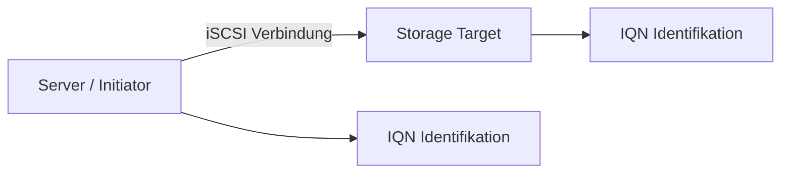

---
# Identity (stable; never change after publishing)
id: ap1-0082
slug: "iscsi-iqn-notation"

# Display
title: "Notation einer iSCSI-Verbindung (IQN)"

# Classification / navigation (machine-side)
module: "Beurteilen marktgängiger IT-Systeme und Lösungen"
topics: ["Speichertechnologien", "iSCSI", "Storage-Netzwerke"]
tags: ["iscsi","storage","san"]

# Flashcard payload
card:
  type: definition
  question: "Wie lautet die Notation einer iSCSI-Verbindung?"
  answer: "Die Notation einer iSCSI-Verbindung erfolgt über einen iSCSI Qualified Name (IQN) im Format: iqn.yyyy-mm.naming-authority:unique-name."
  examples:
    - "iqn.2005-01.com.microsoft:iscsi:name1"
    - "iqn.2019-01.com.vmware:storage:name1"
    - "iqn.2021-02.com.microsoft:kunden:name99"

# Lifecycle
status: draft
created: "2026-03-14"
updated: "2026-03-16"
---

<!-- Optional: extra explanation, diagrams, tables, links, etc.
     Keep the "answer" concise; put longer context here if useful. -->

## Notation einer iSCSI-Verbindung (IQN)

Bei **iSCSI-Verbindungen** benötigen sowohl **Initiator (Client)** als auch **Target (Storage-System)** eindeutige Namen.

Diese eindeutige Identifikation erfolgt über den **iSCSI Qualified Name (IQN)**.

Der IQN funktioniert ähnlich wie eine **eindeutige Adresse**, vergleichbar mit einer IP-Adresse innerhalb des Storage-Netzwerks.

---

## Kernerklärung

Die Struktur eines **iSCSI Qualified Name (IQN)** lautet:

```
iqn.yyyy-mm.naming-authority:unique-name
```

### Bedeutung der Bestandteile

| Bestandteil | Beschreibung |
|---|---|
| iqn | Kennzeichnung für iSCSI Qualified Name |
| yyyy-mm | Jahr und Monat der Registrierung der Naming Authority |
| naming-authority | Organisation oder Domainname, die den Namen erstellt |
| unique-name | Eindeutiger Name des Hosts oder Storage-Geräts |

Wichtig:

- Jeder **IQN muss weltweit eindeutig sein**
- Namen werden nach der **Naming Authority mit Doppelpunkt getrennt**

---

## Praktisches Beispiel

Ein Storage-System eines Unternehmens könnte folgende IQN verwenden:

```
iqn.2021-02.com.example:storage01
```

Bedeutung:

- **2021-02** → Registrierung im Februar 2021  
- **com.example** → Organisation  
- **storage01** → eindeutiger Gerätename



---

## Prüfungsrelevanz (AP1)

### Typische Prüfungsfragen

- Was ist ein **IQN**?
- Wie ist die **Notation eines iSCSI Qualified Name** aufgebaut?
- Welche Bestandteile enthält ein **iSCSI-Name**?

### Antworten auf die typischen Prüfungsfragen

**IQN**

Ein **iSCSI Qualified Name** ist eine **weltweit eindeutige Bezeichnung für iSCSI-Geräte**.

**Notation**

```
iqn.yyyy-mm.naming-authority:unique-name
```

**Bestandteile**

- iqn  
- Jahr und Monat der Registrierung  
- Naming Authority (Organisation/Domain)  
- eindeutiger Gerätename  

---

## Merksatz

> Ein **IQN** identifiziert eindeutig einen **iSCSI-Initiator oder ein Storage-Target im Netzwerk**.