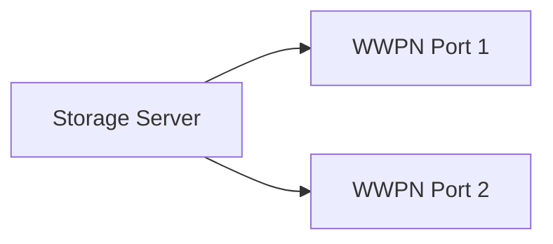

---
# Identity (stable; never change after publishing)
id: ap1-0083
slug: "fibre-channel-adressierung-wwn"

# Display
title: "Adressierung bei Fibre Channel (WWN)"

# Classification / navigation (machine-side)
module: "Beurteilen marktgängiger IT-Systeme und Lösungen"
topics: ["Storage-Netzwerke", "Fibre Channel", "SAN"]
tags: ["wwn","storage","fibre-channel"]

# Flashcard payload
card:
  type: definition
  question: "Wie wird eine Fibre Channel Verbindung adressiert?"
  answer: "Fibre Channel Geräte werden über eine weltweit eindeutige World Wide Name (WWN) Adresse identifiziert, meist als WWNN (Node Name) oder WWPN (Port Name), ein 64-Bit hexadezimaler Wert ähnlich einer MAC-Adresse."
  examples:
    - "20:00:05:45:E4:67:A3:88"
    - "10:00:00:00:C9:12:34:56"

# Lifecycle
status: draft
created: "2026-03-14"
updated: "2026-03-16"
---

<!-- Optional: extra explanation, diagrams, tables, links, etc.
     Keep the "answer" concise; put longer context here if useful. -->

## Adressierung bei Fibre Channel (WWN)

Im **Fibre Channel Storage-Netzwerk (SAN)** benötigt jedes Gerät eine **eindeutige Identifikation**, um miteinander kommunizieren zu können.

Diese Identifikation erfolgt über die **World Wide Name (WWN)** Adresse.

Sie erfüllt eine ähnliche Funktion wie eine **MAC-Adresse im Ethernet-Netzwerk**.

---

## Kernerklärung

Die **WWN (World Wide Name)** ist eine **64-Bit Adresse im Hexadezimalformat**, die jedem Fibre-Channel-Gerät weltweit eindeutig zugewiesen wird.

Es gibt zwei häufige Varianten:

| Typ | Bedeutung | Beschreibung |
|---|---|---|
| WWNN | World Wide Node Name | Identifiziert das gesamte Gerät |
| WWPN | World Wide Port Name | Identifiziert einen einzelnen Port eines Geräts |

Ein Gerät kann:

- **einen WWNN besitzen**
- **mehrere WWPNs** (für verschiedene Ports)

---

## Praktisches Beispiel

Ein Storage-Server besitzt zwei Fibre-Channel-Ports.



Beispieladresse:

```
20:00:05:45:E4:67:A3:88
```

Bedeutung:

- 64-Bit Wert
- Hexadezimale Darstellung
- weltweit eindeutig

---

## Prüfungsrelevanz (AP1)

### Typische Prüfungsfragen

- Wie werden Geräte im **Fibre Channel Netzwerk** adressiert?
- Was bedeutet **WWN**?
- Was ist der Unterschied zwischen **WWNN** und **WWPN**?

### Antworten auf die typischen Prüfungsfragen

**Adressierung**

Über eine **World Wide Name (WWN)** Adresse.

**WWN**

Eine **weltweit eindeutige 64-Bit Adresse**, ähnlich einer MAC-Adresse.

**Unterschied**

| Begriff | Bedeutung |
|---|---|
| WWNN | identifiziert das Gerät |
| WWPN | identifiziert einen Port |

---

## Merksatz

> In Fibre Channel Netzwerken identifizieren **WWN-Adressen Geräte und Ports weltweit eindeutig**.