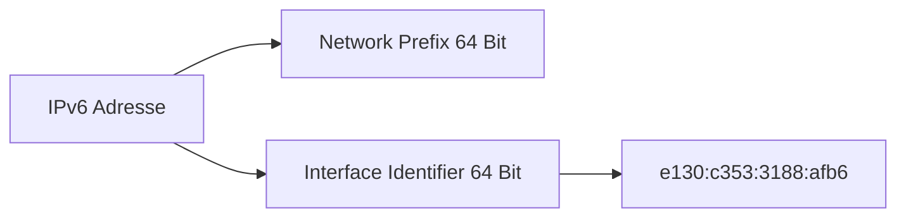

---
# Identity (stable; never change after publishing)
id: ap1-0089
slug: ipv6-adresse-verkuerzte-schreibweise

# Display
title: "Verkürzte Schreibweise einer IPv6-Adresse"

# Classification / navigation (machine-side)
module: "netze"
topics: ["ipv6", "adressierung"]
tags: ["ipv6", "adressformat", "netzwerkgrundlagen"]

# Flashcard payload
card:
  type: basic
  question: "Kürze bitte die Schreibweise der IPv6-Adresse 2003:00dc:075a:dd00:00:e130:c353:3188:afb6 und definiere vollständig den 64-bit Interface-Anteil."
  answer: "Verkürzte Schreibweise: 2003:dc:75a:dd00:e130:c353:3188:afb6. Der 64-Bit Interface-Anteil lautet: e130:c353:3188:afb6."
  examples: []

# Lifecycle
status: draft
created: "2026-03-14"
updated: "2026-03-16"
---

## Verkürzte Schreibweise einer IPv6-Adresse

IPv6-Adressen können zur besseren Lesbarkeit **verkürzt dargestellt** werden.  
Dabei dürfen:

- **führende Nullen in einem Block entfernt werden**
- Gruppen von Nullen vereinfacht dargestellt werden

Die eigentliche Adresse bleibt dabei **logisch identisch**.

---

## Kernerklärung

Eine IPv6-Adresse besteht aus:

- **128 Bit**
- **8 Blöcken zu je 16 Bit**
- Darstellung in **Hexadezimal**
- Trennung durch **Doppelpunkte (`:`)**

Beispiel (vollständig):

```
2003:00dc:075a:dd00:00:e130:c353:3188:afb6
```

Regeln zur Verkürzung:

| Regel | Beispiel |
|---|---|
| Führende Nullen entfernen | `00dc → dc` |
| Führende Nullen entfernen | `075a → 75a` |
| Einzelne Nullblöcke kürzen | `00 → 0` |

Ergebnis:

```
2003:dc:75a:dd00:e130:c353:3188:afb6
```

Der **Interface Identifier** umfasst typischerweise die **letzten 64 Bit** der Adresse.

---

## Praktisches Beispiel

Gegebene Adresse:

```
2003:00dc:075a:dd00:00:e130:c353:3188:afb6
```

Verkürzt:

```
2003:dc:75a:dd00:e130:c353:3188:afb6
```

Aufteilung:

| Bereich | Wert |
|---|---|
| Network Prefix (erste 64 Bit) | 2003:dc:75a:dd00 |
| Interface Identifier (letzte 64 Bit) | e130:c353:3188:afb6 |



---

## Prüfungsrelevanz (AP1)

In der AP1 werden häufig Aufgaben gestellt wie:

- IPv6-Adresse **verkürzen**
- **Interface Identifier bestimmen**
- **Network Prefix erkennen**

Diese Aufgaben testen das Verständnis der **Adressstruktur von IPv6**.

---

### Typische Prüfungsfragen

- Welche Regeln gelten für die Verkürzung von IPv6-Adressen?
- Wie bestimmt man den Interface Identifier?
- Welche Teile gehören zum Network Prefix?

---

### Antworten auf die typischen Prüfungsfragen

**Welche Regeln gelten für die Verkürzung?**

- Führende Nullen entfernen  
- Nullblöcke können verkürzt werden

**Wie bestimmt man den Interface Identifier?**

→ Die **letzten 64 Bit** der IPv6-Adresse.

**Welche Teile gehören zum Network Prefix?**

→ Die **ersten 64 Bit** der Adresse.

---

## Merksatz

**Bei IPv6 dürfen führende Nullen entfernt werden – der Interface Identifier sind immer die letzten 64 Bit der Adresse.**