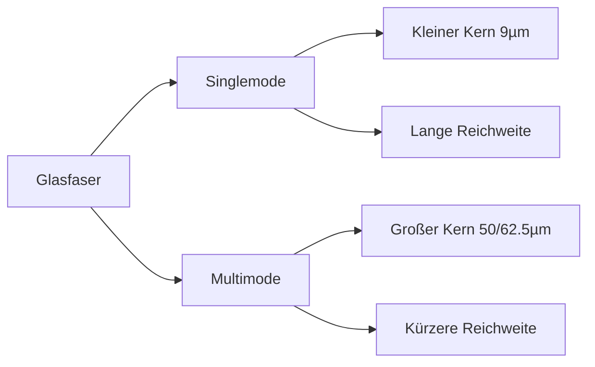

---
# Identity (stable; never change after publishing)
id: ap1-0092
slug: singlemode-vs-multimode-glasfaser

# Display
title: "Unterschied zwischen Singlemode- und Multimode-Glasfaser"

# Classification / navigation (machine-side)
module: "netze"
topics: ["netzwerktechnik", "glasfaser", "physikalische-uebertragung"]
tags: ["glasfaser", "singlemode", "multimode", "lichtwellenleiter"]

# Flashcard payload
card:
  type: basic
  question: "Worin unterscheiden sich die Lichtwellenleiter der Single- und Multimodefasern?"
  answer: "Singlemodefasern besitzen einen deutlich kleineren Faserkern (ca. 9 µm) als Multimodefasern (50 µm oder 62,5 µm). Dadurch können Singlemodefasern größere Übertragungsstrecken erreichen (bis ca. 10 km), während Multimodefasern kürzere Distanzen (bis ca. 2 km) unterstützen."
  examples: []

# Lifecycle
status: draft
created: "2026-03-14"
updated: "2026-03-16"
---

## Unterschied zwischen Singlemode- und Multimode-Glasfaser

Glasfaserkabel (Lichtwellenleiter) werden hauptsächlich in zwei Varianten verwendet:

- **Singlemode-Fasern**
- **Multimode-Fasern**

Der wichtigste Unterschied liegt im **Durchmesser des Faserkerns** und der **Art der Lichtausbreitung**, was sich direkt auf **Reichweite und Einsatzgebiet** auswirkt.

---

## Kernerklärung

Der Aufbau einer Glasfaser besteht aus mehreren Schichten:

- **Faserkern (Core)** – leitet das Licht
- **Glasmantel (Cladding)** – reflektiert das Licht im Kern
- **Beschichtung / Kabelmantel** – mechanischer Schutz

Der Unterschied zwischen Singlemode und Multimode liegt hauptsächlich im **Kerndurchmesser**.

| Eigenschaft | Singlemode | Multimode |
|---|---|---|
| Kerndurchmesser | ca. **9 µm** | **50 µm oder 62,5 µm** |
| Lichtausbreitung | nur **ein Lichtmodus** | **mehrere Lichtmoden** |
| Reichweite | bis ca. **10.000 m** | bis ca. **2.000 m** |
| Einsatz | Weitverkehr, Backbone | LAN, Rechenzentrum |

### Warum ist die Reichweite unterschiedlich?

Bei **Multimodefasern** laufen mehrere Lichtstrahlen gleichzeitig durch den Kern.  
Diese reflektieren unterschiedlich stark und verursachen **Signalstreuung (Modaldispersion)**.

Bei **Singlemodefasern** wird nur **ein Lichtstrahl** übertragen. Dadurch entstehen deutlich **weniger Signalverzerrungen** und größere Reichweiten.

---

## Praktisches Beispiel

Typische Einsatzbereiche:

| Einsatz | Faserart |
|---|---|
| Internet-Backbone | Singlemode |
| Provider-Netze | Singlemode |
| Rechenzentrum | Multimode |
| Gebäude-Netzwerk | Multimode |

Ein **Glasfaseranschluss eines Internetproviders** nutzt meist **Singlemode**, da große Distanzen überbrückt werden müssen.

---

## Prüfungsrelevanz (AP1)

In der AP1 wird häufig abgefragt:

- Unterschied zwischen **Singlemode und Multimode**
- **Kerndurchmesser**
- **Reichweite**
- typische **Einsatzbereiche**

Diese Frage gehört zu den **klassischen Grundlagen der Netzwerktechnik**.

---

### Typische Prüfungsfragen

- Was ist der Hauptunterschied zwischen Singlemode und Multimode?
- Welche Faser hat den kleineren Kern?
- Welche Glasfaser erreicht größere Übertragungsstrecken?

---

### Antworten auf die typischen Prüfungsfragen

**Hauptunterschied?**  
→ Der **Kerndurchmesser** und die **Anzahl der Lichtmoden**.

**Welche Faser hat den kleineren Kern?**  
→ **Singlemode (ca. 9 µm)**.

**Welche Faser hat größere Reichweite?**  
→ **Singlemodefasern**.

---

## Merksatz

**Singlemode = kleiner Kern, große Reichweite.  
Multimode = größerer Kern, kürzere Reichweite.**