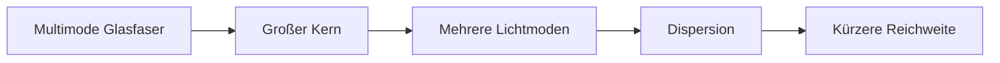

---
# Identity (stable; never change after publishing)
id: ap1-0094
slug: multimode-glasfaser-vor-und-nachteile

# Display
title: "Vor- und Nachteile von Multimode-Glasfasern"

# Classification / navigation (machine-side)
module: "netze"
topics: ["netzwerktechnik", "glasfaser", "physikalische-uebertragung"]
tags: ["glasfaser", "multimode", "lichtwellenleiter"]

# Flashcard payload
card:
  type: basic
  question: "Nenne Vor- und Nachteile von Multimodefasern."
  answer: "Vorteile: geringerer Herstellungsaufwand, einfachere Verbindungstechnik durch größeren Kerndurchmesser, verfügbar als Stufenindex- und Gradientenindexfaser. Nachteile: größere Signaldämpfung und Laufzeitverschiebung, geringere maximale Bandbreiten, nur für kürzere Distanzen geeignet, bei größeren Entfernungen Verstärker erforderlich."
  examples: []

# Lifecycle
status: draft
created: "2026-03-17"
updated: "2026-03-17"
---

## Vor- und Nachteile von Multimode-Glasfasern

**Multimode-Glasfasern** werden hauptsächlich in **lokalen Netzwerken (LAN)** und **Rechenzentren** eingesetzt.  
Durch ihren **größeren Faserkern** können mehrere Lichtstrahlen gleichzeitig übertragen werden.

Das macht sie **einfacher und günstiger**, führt aber zu **Signalverlusten bei größeren Entfernungen**.

---

## Kernerklärung

Multimodefasern besitzen einen **größeren Kern (50 µm oder 62,5 µm)**. Dadurch breiten sich mehrere Lichtstrahlen (Moden) gleichzeitig aus.

### Vorteile

- **geringerer Aufwand in der Herstellung**
- **einfachere Verbindungstechnik** durch größeren Kerndurchmesser
- verfügbar als:
  - **Stufenindexfaser**
  - **Gradientenindexfaser**

### Nachteile

- **größere Signaldämpfung**
- **Laufzeitverschiebungen (Modaldispersion)**
- **geringere maximale Bandbreiten**
- **nur für kürzere Distanzen geeignet**
- bei größeren Entfernungen: **Verstärker oder Signalaufbereitung notwendig**

---

## Praktisches Beispiel

Typische Einsatzbereiche:

| Einsatzbereich | Faserart |
|---|---|
| Rechenzentrum (Racks) | Multimode |
| Büro-Netzwerke | Multimode |
| kurze Gebäudeverbindungen | Multimode |

---

## Prüfungsrelevanz (AP1)

Sehr häufiges Thema in der AP1:

- Unterschiede **Multimode vs. Singlemode**
- Vor- und Nachteile von Multimode
- Zusammenhang zwischen **Kerndurchmesser und Signalverhalten**

---

### Typische Prüfungsfragen

- Warum ist Multimode günstiger als Singlemode?
- Welche Nachteile hat Multimode bei großen Entfernungen?
- Wofür wird Multimode typischerweise eingesetzt?

---

### Antworten auf die typischen Prüfungsfragen

**Warum günstiger?**  
→ Größerer Kern → **einfachere Herstellung und Verbindungstechnik**

**Nachteile bei großen Entfernungen?**  
→ **Dispersion und Dämpfung → Signalverschlechterung**

**Typischer Einsatz?**  
→ **LAN, Rechenzentren, kurze Strecken**

---

## Merksatz

**Multimode: günstig und einfach – aber nur für kurze Strecken geeignet.**