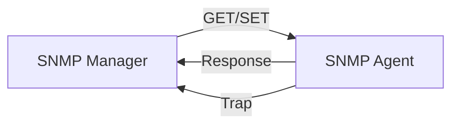

---
# Identity (stable; never change after publishing)
id: ap1-0095
slug: snmp-aufgabe-und-funktion

# Display
title: "SNMP – Aufgabe und Funktion"

# Classification / navigation (machine-side)
module: "netze"
topics: ["netzwerkmanagement", "protokolle"]
tags: ["snmp", "monitoring", "netzwerkverwaltung"]

# Flashcard payload
card:
  type: basic
  question: "Welche Aufgabe hat das Simple Network Management Protocol, kurz SNMP?"
  answer: "SNMP ist ein Netzwerkprotokoll zur Überwachung und Verwaltung von Netzwerkgeräten. Es ermöglicht das zentrale Auslesen und Steuern von Geräten wie Routern, Switches oder Servern über eine Management-Konsole."
  examples: []

# Lifecycle
status: draft
created: "2026-03-17"
updated: "2026-03-17"
---

## SNMP – Aufgabe und Funktion

Das **Simple Network Management Protocol (SNMP)** ist ein **Standardprotokoll zur Netzwerküberwachung und -verwaltung**.

Es ermöglicht Administratoren, **Netzwerkgeräte zentral zu überwachen, zu konfigurieren und zu steuern**.

---

## Kernerklärung

SNMP arbeitet nach dem Prinzip:

- **Manager (Management-Konsole)** ↔ **Agent (auf dem Gerät)**

### Bestandteile

| Komponente | Beschreibung |
|---|---|
| SNMP-Manager | Zentrale Verwaltungssoftware |
| SNMP-Agent | Dienst auf Netzwerkgeräten |
| MIB (Management Information Base) | Datenstruktur mit Geräteinformationen |

### Funktionsweise

- Geräte (z. B. Router, Switches, Drucker) besitzen einen **SNMP-Agenten**
- Der **Manager** sendet Anfragen (z. B. GET)
- Der Agent liefert Informationen zurück (z. B. Status, Auslastung)
- Geräte können auch selbst Meldungen senden (**Trap**)

Typische Ports:

- **UDP 161** → Anfragen (GET/SET)
- **UDP 162** → Traps

---

## Praktisches Beispiel

Ein Administrator überwacht ein Netzwerk:

- Router meldet **hohe CPU-Auslastung**
- Switch sendet einen **Fehler (Trap)**
- Server liefert **Statusdaten per GET-Anfrage**

Alle Informationen werden in einer **zentralen Management-Software** dargestellt.

---

## Prüfungsrelevanz (AP1)

SNMP gehört zu den **klassischen Protokoll-Grundlagen**.

Wichtige Punkte:

- Zweck von SNMP
- Begriffe: **Manager, Agent, Trap**
- typische Ports

---

### Typische Prüfungsfragen

- Wofür wird SNMP eingesetzt?
- Welche Komponenten gehören zu SNMP?
- Was ist ein SNMP-Trap?

---

### Antworten auf die typischen Prüfungsfragen

**Wofür wird SNMP eingesetzt?**  
→ Zur **Überwachung und Verwaltung von Netzwerkgeräten**

**Welche Komponenten gibt es?**  
→ **Manager, Agent, MIB**

**Was ist ein Trap?**  
→ Eine **automatische Meldung eines Geräts** an den Manager

---

## Merksatz

**SNMP = zentrales Überwachen und Steuern von Netzwerkgeräten über Manager und Agenten.**