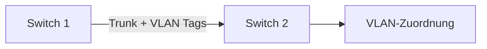

---
# Identity (stable; never change after publishing)
id: ap1-0101
slug: tagged-vlan-einsatz

# Display
title: "Tagged VLAN – Einsatz"

# Classification / navigation (machine-side)
module: "netze"
topics: ["vlan", "switching"]
tags: ["vlan", "tagging", "trunk"]

# Flashcard payload
card:
  type: basic
  question: "Wann kommt ein tagged VLAN (Virtual Local Area Network) zum Einsatz?"
  answer: "Ein tagged VLAN wird eingesetzt, wenn mehrere VLANs über eine Verbindung (Trunk-Port) zwischen Switches übertragen werden. Dabei werden Ethernet-Frames mit VLAN-Tags versehen, um die Zugehörigkeit zu kennzeichnen."
  examples: []

# Lifecycle
status: draft
created: "2026-03-17"
updated: "2026-03-17"
---

## Tagged VLAN – Einsatz

Ein **tagged VLAN** wird verwendet, um **mehrere VLANs über eine einzige physische Verbindung** zu übertragen.

Typischer Einsatz:
- Verbindung zwischen Switches
- Trunk-Ports

---

## Kernerklärung

Beim tagged VLAN:

- Ethernet-Frames erhalten ein **VLAN-Tag**
- Dieses Tag enthält:
  - VLAN-ID
- Dadurch können mehrere VLANs gleichzeitig übertragen werden

### Wann notwendig?

- Wenn sich VLANs über **mehrere Switches erstrecken**
- Wenn eine Leitung **mehrere Netzwerke transportieren soll**

### Funktionsweise

| Schritt | Beschreibung |
|---|---|
| 1 | Frame wird mit VLAN-ID versehen |
| 2 | Übertragung über Trunk-Port |
| 3 | Ziel-Switch wertet Tag aus |
| 4 | Weiterleitung ins richtige VLAN |

---

## Praktisches Beispiel

Ein Unternehmen hat:

- VLAN 10 → Verwaltung  
- VLAN 20 → IT  

Zwischen zwei Switches:

- nur **ein Kabel**
- beide VLANs laufen darüber
- → Frames werden **getaggt**, damit sie korrekt zugeordnet werden

---

## Prüfungsrelevanz (AP1)

Wichtige Punkte:

- Unterschied **tagged vs. untagged**
- Begriff **Trunk-Port**
- Zweck von VLAN-Tags

---

### Typische Prüfungsfragen

- Wann braucht man tagged VLANs?
- Was ist ein Trunk-Port?
- Wozu dient das VLAN-Tag?

---

### Antworten auf die typischen Prüfungsfragen

**Wann tagged VLAN?**  
→ bei mehreren VLANs über eine Verbindung

**Was ist ein Trunk-Port?**  
→ Port für mehrere VLANs gleichzeitig

**Wozu das Tag?**  
→ Kennzeichnung der VLAN-Zugehörigkeit

---

## Merksatz

**Tagged VLAN = mehrere VLANs über ein Kabel dank Kennzeichnung (Tag).**