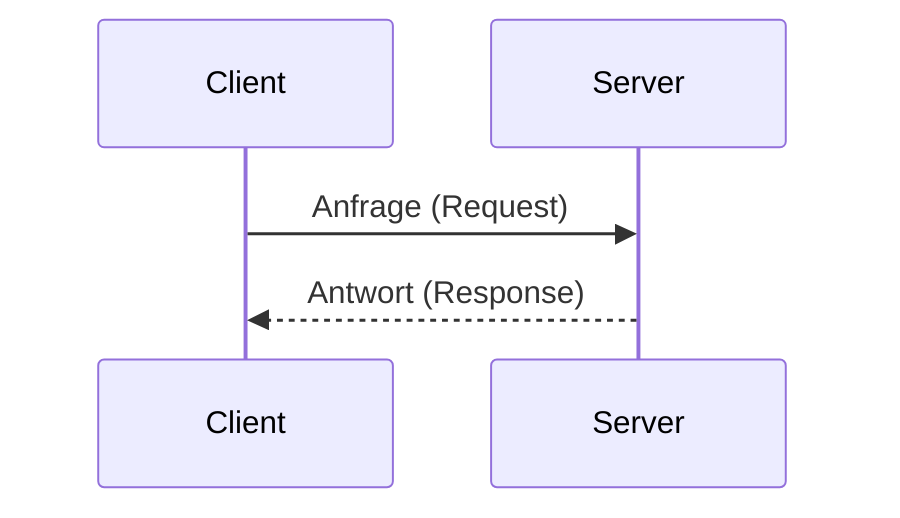

---
# Identity (stable; never change after publishing)
id: ap1-0102
slug: client-server-modell-merkmale

# Display
title: "Client-Server-Modell – typische Merkmale"

# Classification / navigation (machine-side)
module: "netze"
topics: ["client-server", "architektur"]
tags: ["client-server", "netzwerkmodelle"]

# Flashcard payload
card:
  type: basic
  question: "Beschreibe typische Merkmale des Client-Server-Modells."
  answer: "Server stellen Dienste bereit, Clients fordern diese an. Die Kommunikation erfolgt über Protokolle. Ein Server kann mehrere Clients bedienen, Funktionen sind nicht hardwaregebunden und Systeme können gleichzeitig Client und Server sein."
  examples: []

# Lifecycle
status: draft
created: "2026-03-17"
updated: "2026-03-17"
---

## Client-Server-Modell – typische Merkmale

Das **Client-Server-Modell** ist ein grundlegendes Konzept in Netzwerken.

- **Server** → bieten Dienste an  
- **Clients** → nutzen diese Dienste  

---

## Kernerklärung

### Typische Merkmale

| Merkmal | Beschreibung |
|---|---|
| Dienstebereitstellung | Server stellen Services bereit |
| Anfrageprinzip | Clients senden Anfragen |
| Kommunikation | erfolgt über definierte Protokolle |
| Mehrbenutzerfähigkeit | ein Server bedient mehrere Clients |
| Entkopplung | Funktionen sind nicht an Hardware gebunden |
| Rollenflexibilität | Systeme können Client und Server zugleich sein |

### Grundprinzip

- Client → Anfrage (Request)
- Server → Antwort (Response)

---

## Praktisches Beispiel

Beim Surfen im Internet:

- Browser (Client) sendet Anfrage an Webserver
- Webserver liefert Webseite zurück

→ klassisches **Client-Server-Prinzip**

---

## Prüfungsrelevanz (AP1)

Sehr häufig gefragt:

- Rollen von Client und Server
- typische Merkmale aufzählen
- Beispiele nennen

---

### Typische Prüfungsfragen

- Was macht ein Server im Client-Server-Modell?
- Welche Rolle hat der Client?
- Nenne typische Merkmale dieses Modells.

---

### Antworten auf die typischen Prüfungsfragen

**Was macht der Server?**  
→ stellt Dienste bereit  

**Was macht der Client?**  
→ fordert Dienste an  

**Typische Merkmale?**  
→ Anfrage/Antwort, Protokolle, mehrere Clients, flexible Rollen  

---

## Merksatz

**Client fragt – Server antwortet.**