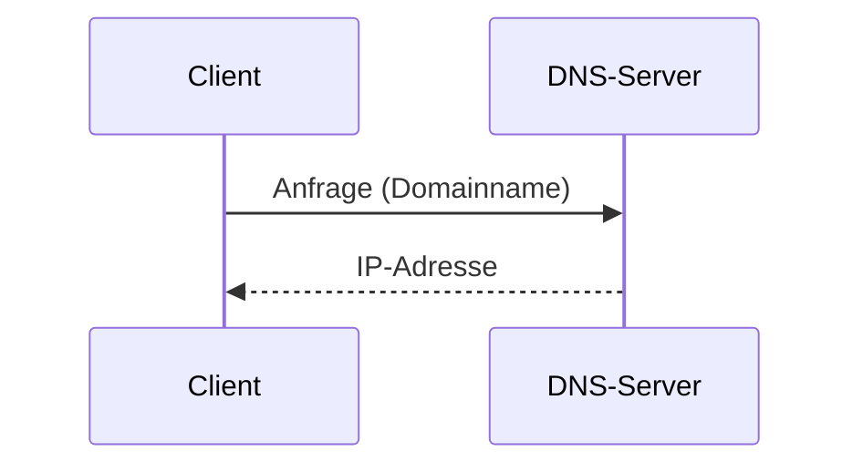

---
# Identity (stable; never change after publishing)
id: ap1-0103
slug: dns-aufgaben-active-directory

# Display
title: "DNS – Aufgaben in Windows-Domänen / Active Directory"

# Classification / navigation (machine-side)
module: "netze"
topics: ["dns", "namensauflösung"]
tags: ["dns", "active-directory", "netzwerkdienste"]

# Flashcard payload
card:
  type: basic
  question: "Welche Aufgaben hat ein Domain Name System (DNS) in einer Windows-Domänenlandschaft bzw. Active Directory?"
  answer: "DNS übernimmt die Namensauflösung (Name ↔ IP-Adresse) und ermöglicht zusätzlich Reverse Lookup (IP → Name), z. B. über PTR-Records in der Reverse Lookup Zone (Active Directory)."
  examples: []

# Lifecycle
status: draft
created: "2026-03-17"
updated: "2026-03-17"
---

## DNS – Aufgaben in Windows-Domänen / Active Directory

Das **Domain Name System (DNS)** ist ein zentraler Netzwerkdienst:

- Übersetzt **Domainnamen → IP-Adressen**
- Ermöglicht auch die Rückauflösung (**IP → Name**)

In **Windows-Domänen / Active Directory** ist DNS unverzichtbar.

---

## Kernerklärung

### Hauptaufgaben von DNS

| Aufgabe | Beschreibung |
|---|---|
| Forward Lookup | Name → IP-Adresse (z. B. www.example.com → 192.168.1.1) |
| Reverse Lookup | IP-Adresse → Name |
| Anfragebeantwortung | DNS beantwortet Namensanfragen im Netzwerk |

### Besonderheit in Active Directory

- Reverse Lookup erfolgt über:
  - **PTR-Records**
  - **Reverse Lookup Zone**

### Ablauf der Namensauflösung

---

## Praktisches Beispiel

- Client fragt: `server01.firma.local`
- DNS antwortet: `192.168.10.5`

Reverse:

- Anfrage: `192.168.10.5`
- Antwort: `server01.firma.local`

---

## Prüfungsrelevanz (AP1)

Wichtig für AP1:

- Unterschied **Forward vs. Reverse Lookup**
- Rolle von DNS im Netzwerk
- Zusammenhang mit Active Directory

---

### Typische Prüfungsfragen

- Was macht ein DNS?
- Was ist ein Reverse Lookup?
- Welche Records werden für Reverse Lookup verwendet?

---

### Antworten auf die typischen Prüfungsfragen

**Was macht DNS?**  
→ Übersetzt Namen in IP-Adressen  

**Was ist Reverse Lookup?**  
→ IP-Adresse wird in Namen aufgelöst  

**Welche Records?**  
→ PTR-Records  

---

## Merksatz

**DNS übersetzt Namen in IPs – und bei Bedarf auch zurück.**