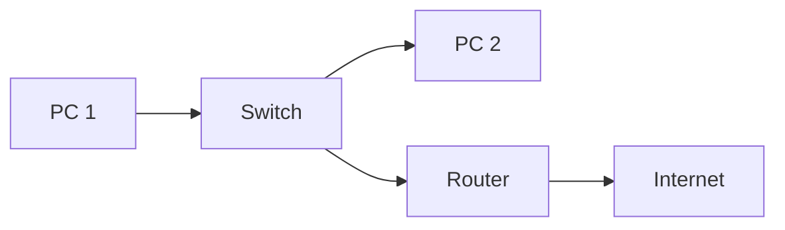

---
# Identity (stable; never change after publishing)
id: ap1-0105
slug: unterschied-switch-router

# Display
title: "Switch vs. Router – Unterschiede"

# Classification / navigation (machine-side)
module: "netze"
topics: ["switch", "router", "osi-modell"]
tags: ["netzwerkgeraete", "osi", "routing", "switching"]

# Flashcard payload
card:
  type: comparison
  question: "Erläutere den Unterschied zwischen einem Switch und einem Router."
  answer: "Switch: arbeitet auf OSI-Schicht 2, leitet Frames anhand von MAC-Adressen weiter. Router: arbeitet auf OSI-Schicht 3, verbindet Netzwerke und routet Pakete anhand von IP-Adressen."
  examples: []

# Lifecycle
status: draft
created: "2026-03-17"
updated: "2026-03-17"
---

## Unterschied Switch vs. Router

Switches und Router sind zentrale Netzwerkgeräte mit unterschiedlichen Aufgaben:

- **Switch** → verbindet Geräte innerhalb eines Netzwerks  
- **Router** → verbindet verschiedene Netzwerke  

---

## Kernerklärung

### Vergleich Switch vs. Router

| Merkmal | Switch | Router |
|---|---|---|
| OSI-Schicht | Schicht 2 (Data Link) | Schicht 3 (Network) |
| Verarbeitung | Ethernet-Frames (IEEE 802.3) | IP-Pakete |
| Adressierung | MAC-Adresse | IP-Adresse |
| Aufgabe | Weiterleitung im gleichen Netzwerk | Verbindung zwischen Netzwerken |
| Protokolle | keine Routingprotokolle | z. B. OSPF, RIP, BGP |

### Funktionsprinzip

- Switch: interne Kommunikation  
- Router: externe Kommunikation  

---

## Praktisches Beispiel

- Büro-Netzwerk:
  - PCs sind über einen **Switch** verbunden  
  - Internetzugang erfolgt über einen **Router**  

---

## Prüfungsrelevanz (AP1)

Sehr häufig:

- OSI-Schichten zuordnen
- Unterschied MAC vs. IP verstehen
- Aufgaben von Switch und Router erklären

---

### Typische Prüfungsfragen

- Auf welcher OSI-Schicht arbeitet ein Switch?
- Welche Adresse nutzt ein Router?
- Wofür wird ein Router eingesetzt?

---

### Antworten auf die typischen Prüfungsfragen

**Switch-Schicht?**  
→ Layer 2  

**Router-Adresse?**  
→ IP-Adresse  

**Aufgabe Router?**  
→ verbindet Netzwerke  

---

## Merksatz

**Switch verbindet Geräte – Router verbindet Netzwerke.**