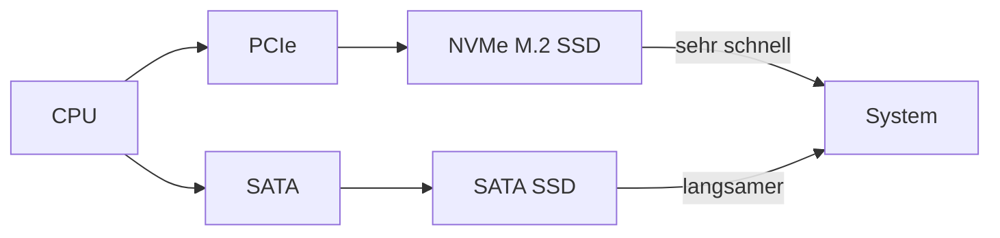

---
# Identity (stable; never change after publishing)
id: ap1-0112
slug: m2-ssd-vor-und-nachteile

# Display
title: "M.2-SSD – Vor- und Nachteile"

# Classification / navigation (machine-side)
module: "hardware"
topics: ["speicher", "massenspeicher"]
tags: ["ssd", "m2", "nvme"]

# Flashcard payload
card:
  type: comparison
  question: "Ermittle Vor- und Nachteile einer M.2-SSD."
  answer: "Vorteile: sehr hohe Geschwindigkeit (bis ~7.450 MB/s), kompaktes Design, keine Verkabelung, direkte Mainboard-Anbindung (NVMe). Nachteile: teurer, nicht mit allen Mainboards kompatibel, höhere Wärmeentwicklung, oft geringere Kapazität als SATA-SSDs."
  examples: ["NVMe M.2 SSD im Gaming-PC", "Ultrabook mit platzsparender M.2 SSD"]

# Lifecycle
status: draft
created: "2026-03-17"
updated: "2026-03-17"
---

## M.2-SSD – Vor- und Nachteile

Die **M.2-SSD** ist ein moderner Massenspeicher mit sehr hoher Geschwindigkeit und kompaktem Aufbau.

- direkt auf dem Mainboard verbaut  
- häufig mit **NVMe-Protokoll**  
- ersetzt zunehmend klassische SATA-SSDs  

---

## Kernerklärung

### Vorteile

- sehr hohe **Lesegeschwindigkeit** (bis ca. 7.450 MB/s)  
- **kompaktes Format** (kein zusätzliches Gehäuse nötig)  
- **keine Kabel** erforderlich  
- direkte Verbindung zum Mainboard → geringe Latenzen  
- unterstützt moderne Schnittstellen wie **NVMe**  

---

### Nachteile

- **höherer Preis** als SATA-SSDs  
- **Kompatibilität**:
  - nicht jedes Mainboard unterstützt M.2/NVMe  
- **Wärmeentwicklung**:
  - kann bei hoher Last steigen (Thermal Throttling)  
- oft **geringere maximale Kapazität** als klassische SATA-SSDs  

---

### Vergleich: M.2 vs. SATA-SSD

| Merkmal | M.2 (NVMe) | SATA-SSD |
|---|---|---|
| Geschwindigkeit | sehr hoch | hoch |
| Anschluss | direkt Mainboard | SATA-Kabel |
| Platzbedarf | sehr gering | höher |
| Preis | höher | günstiger |

---

### Einordnung im System

---

## Praktisches Beispiel

- Gaming-PC:
  - M.2 SSD für Betriebssystem und Spiele  
- Büro-PC:
  - SATA-SSD ausreichend  

---

## Prüfungsrelevanz (AP1)

Wichtig:

- Unterschiede **M.2 vs. SATA**  
- Vorteile (Geschwindigkeit, Bauform)  
- typische Nachteile (Preis, Hitze, Kompatibilität)  

---

### Typische Prüfungsfragen

- Warum ist eine M.2-SSD schneller als eine SATA-SSD?
- Welche Nachteile hat eine M.2-SSD?
- Wann lohnt sich der Einsatz?

---

### Antworten auf die typischen Prüfungsfragen

**Warum schneller?**  
→ direkte PCIe/NVMe-Anbindung  

**Nachteile?**  
→ teuer, Hitze, Kompatibilität  

**Wann sinnvoll?**  
→ bei hohen Leistungsanforderungen  

---

## Merksatz

**M.2 = maximal schnell, aber teurer und wärmer.**