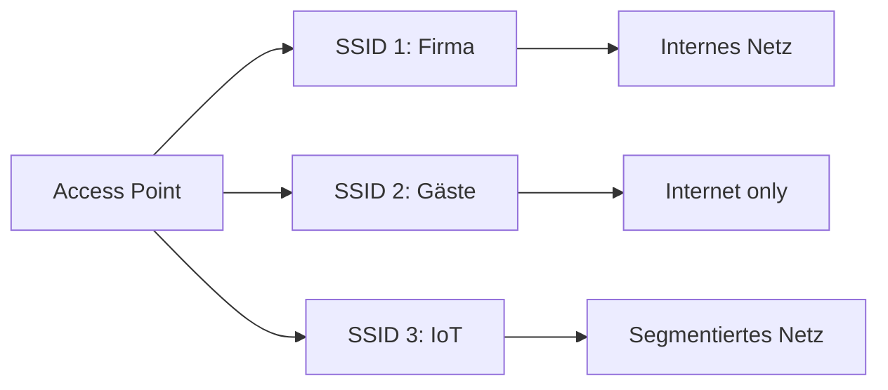

---
# Identity (stable; never change after publishing)
id: ap1-0124
slug: wlan-multi-ssid

# Display
title: "WLAN Multi-SSID: Mehrere Netzwerke über einen Access Point"

# Classification / navigation (machine-side)
module: "itsysteme"
topics: ["WLAN", "Netzwerk", "Access Point"]
tags: ["ap1", "wlan", "ssid"]

# Flashcard payload
card:
  type: basic       # basic | multi | steps | definition | comparison
  question: "Was versteht man unter dem Begriff Multi-SSID?"
  answer: "Multi-SSID ermöglicht es, mit einem Access Point mehrere logisch getrennte WLAN-Netzwerke (SSIDs) bereitzustellen, die unterschiedliche Zugänge und Netzsegmente haben."
  examples: []

# Lifecycle
status: draft       # draft | published | deprecated
created: "2026-03-18"
updated: "2026-03-18"
---

## WLAN Multi-SSID: Mehrere Netzwerke über einen Access Point
**Multi-SSID** ist eine Funktion von WLAN Access Points, mit der mehrere **virtuelle WLAN-Netze** gleichzeitig betrieben werden können.

➡️ Ein physischer Access Point → mehrere logische Netzwerke

## Kernerklärung
Mit Multi-SSID:

- Ein Access Point sendet **mehrere Netzwerknamen (SSIDs)**
- Jedes WLAN kann:
  - eigene **Zugangsdaten**
  - eigene **Sicherheitsregeln**
  - eigenes **Netzsegment (z. B. VLAN)** haben
- Netzwerke sind logisch voneinander getrennt

### Typische Trennung

| SSID            | Zweck                  | Zugriff                |
|-----------------|-----------------------|------------------------|
| Firmen-WLAN     | Mitarbeiter           | internes Netzwerk      |
| Gäste-WLAN      | Besucher              | nur Internet           |
| IoT-WLAN        | Geräte (z. B. Drucker)| eingeschränktes Netz   |

## Praktisches Beispiel
Ein Unternehmen betreibt einen Access Point:

- **SSID 1:** "Firma" → Zugriff auf Server
- **SSID 2:** "Gast" → nur Internet
- **SSID 3:** "IoT" → nur Gerätekommunikation

➡️ Alle laufen über denselben Access Point, sind aber logisch getrennt

## Prüfungsrelevanz (AP1)

### Typische Prüfungsfragen
- Was ist eine SSID?
- Warum nutzt man Multi-SSID?
- Wie werden Netzwerke getrennt?

### Antworten auf die typischen Prüfungsfragen
- SSID = Name eines WLAN-Netzes
- Multi-SSID spart Hardware und ermöglicht Trennung
- Trennung meist über VLANs und unterschiedliche Authentifizierung

## Merksatz
**Ein Access Point – mehrere Netzwerke: Multi-SSID trennt logisch bei gleicher Hardware.**