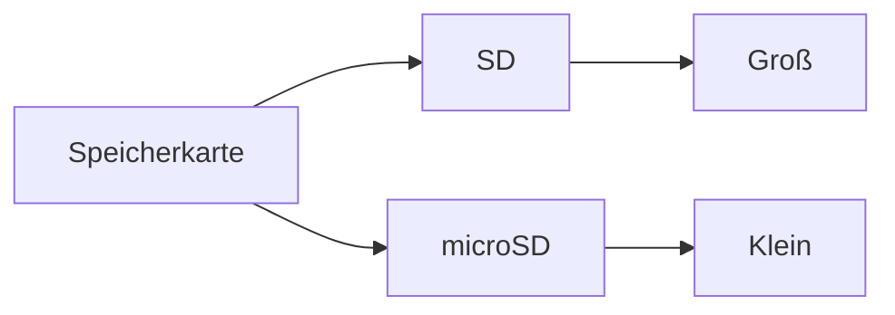

---
# Identity (stable; never change after publishing)
id: ap1-0128
slug: sd-vs-microsd-karte

# Display
title: "SD-Karte vs. microSD-Karte erkennen"

# Classification / navigation (machine-side)
module: "itsysteme"
topics: ["Hardware", "Massenspeicher", "Speicherkarten"]
tags: ["ap1", "hardware", "speicher"]

# Flashcard payload
card:
  type: basic       # basic | multi | steps | definition | comparison
  question: "Welche Speicherkarte ist eine SD-Karte und welche ist eine microSD-Karte?"
  answer: "Die SD-Karte ist Nummer 1, die microSD-Karte ist Nummer 3."
  examples: []

# Lifecycle
status: draft       # draft | published | deprecated
created: "2026-03-18"
updated: "2026-03-18"
---

## SD-Karte vs. microSD-Karte erkennen
Speicherkarten gibt es in verschiedenen Größen und Bauformen.  
Die wichtigsten Varianten sind:

- **SD-Karte (Standardgröße)**
- **microSD-Karte (sehr klein)**

## Kernerklärung

### Erkennung der Karten
- **Nr. 1 → SD-Karte**
  - größere Bauform
  - häufig in Kameras verwendet

- **Nr. 3 → microSD-Karte**
  - sehr kleine Bauform
  - häufig in Smartphones, Tablets

### Unterschiede

| Merkmal        | SD-Karte            | microSD-Karte        |
|----------------|---------------------|----------------------|
| Größe          | groß                | sehr klein           |
| Einsatz        | Kameras, PCs        | Smartphones, Geräte  |
| Adapter nötig  | nein                | oft mit SD-Adapter   |

## Praktisches Beispiel
- Digitalkamera → nutzt **SD-Karte**
- Smartphone → nutzt **microSD-Karte**

➡️ microSD kann mit Adapter in SD-Slot genutzt werden

## Prüfungsrelevanz (AP1)

### Typische Prüfungsfragen
- Unterschied zwischen SD und microSD?
- Welche Karte ist kleiner?
- Wo werden sie eingesetzt?

### Antworten auf die typischen Prüfungsfragen
- Unterschied liegt in der Baugröße
- microSD ist deutlich kleiner
- Einsatz je nach Gerätetyp

## Merksatz
**SD = groß (Kamera), microSD = klein (Smartphone).**