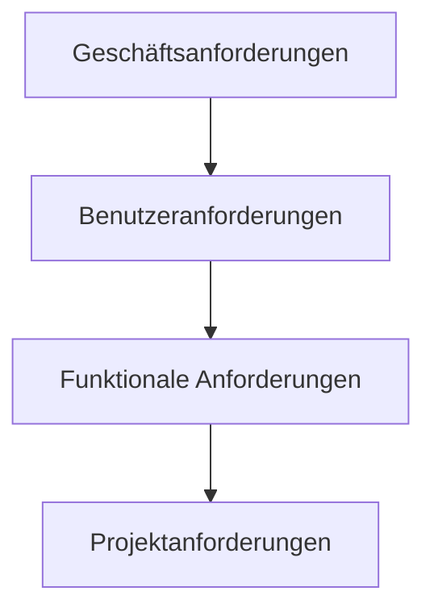

---
# Identity (stable; never change after publishing)
id: ap1-0133
slug: anforderungsarten-software

# Display
title: "Anforderungsarten: Geschäfts-, Benutzer-, funktionale und Projektanforderungen"

# Classification / navigation (machine-side)
module: "itsysteme"
topics: ["Anforderungen", "Softwareentwicklung", "Projektmanagement"]
tags: ["ap1", "anforderungen", "alm"]

# Flashcard payload
card:
  type: basic       # basic | multi | steps | definition | comparison
  question: "Welche Anforderungsarten gibt es und was bedeuten sie?"
  answer: "Geschäftsanforderungen: Ziele aus Kundensicht. Benutzeranforderungen: Anforderungen der Nutzer. Funktionale Anforderungen: konkrete Funktionen der Software. Projektanforderungen: Rahmenbedingungen zur Umsetzung des Projekts."
  examples: ["Geschäft: Umsatz steigern", "Benutzer: einfache Bedienung", "Funktional: Login-System", "Projekt: Zeit- und Budgetvorgaben"]

# Lifecycle
status: draft       # draft | published | deprecated
created: "2026-03-18"
updated: "2026-03-18"
---

## Anforderungsarten: Geschäfts-, Benutzer-, funktionale und Projektanforderungen
In der Softwareentwicklung werden Anforderungen in verschiedene Kategorien unterteilt, um **Ziele, Nutzung und Umsetzung klar zu strukturieren**.

➡️ Vier zentrale Anforderungsarten:
- Geschäftsanforderungen  
- Benutzeranforderungen  
- Funktionale Anforderungen  
- Projektanforderungen  

## Kernerklärung

| Anforderungsart            | Beschreibung |
|--------------------------|-------------|
| **Geschäftsanforderungen** | Anforderungen aus Sicht des Unternehmens/Kunden (z. B. Ziele, Nutzen) |
| **Benutzeranforderungen**  | Anforderungen der Endnutzer an das System (Usability, Funktionen aus Sicht der Nutzer) |
| **Funktionale Anforderungen** | Konkrete Funktionen, die die Software erfüllen muss |
| **Projektanforderungen**   | Rahmenbedingungen (Zeit, Budget, Ressourcen, Organisation) |

### Details

- **Geschäftsanforderungen**
  - entstehen aus Markt- und Kundenbedürfnissen  
  - werden durch Management/Marketing definiert  

- **Benutzeranforderungen**
  - beschreiben, was Nutzer benötigen  
  - werden durch Benutzer oder Analysten erhoben  

- **Funktionale Anforderungen**
  - definieren das Verhalten der Software  
  - werden durch Entwickler/Testabteilungen umgesetzt  

- **Projektanforderungen**
  - sichern den Projekterfolg  
  - werden im Rahmen von **Application Lifecycle Management (ALM)** verwaltet  

## Praktisches Beispiel

Ein Online-Shop:

- **Geschäft:** Umsatz steigern  
- **Benutzer:** einfache Produktsuche  
- **Funktional:** Suchfunktion + Warenkorb  
- **Projekt:** Fertigstellung in 6 Monaten mit festem Budget  

## Prüfungsrelevanz (AP1)

### Typische Prüfungsfragen
- Nenne die vier Anforderungsarten
- Was ist der Unterschied zwischen Benutzer- und funktionalen Anforderungen?
- Wer definiert Geschäftsanforderungen?

### Antworten auf die typischen Prüfungsfragen
- Geschäfts-, Benutzer-, funktionale und Projektanforderungen  
- Benutzer = Sicht des Nutzers, funktional = konkrete Umsetzung  
- Management / Marketing  

## Merksatz
**Vom Ziel (Geschäft) über den Nutzer zur Funktion – umgesetzt im Projekt.**