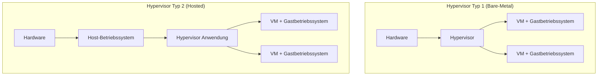

---
# Identity (stable; never change after publishing)
id: ap1-0153
slug: hypervisor-typ1-vs-typ2

# Display
title: "Hypervisor Typ 1 vs. Typ 2"

# Classification / navigation (machine-side)
module: "Beurteilen marktgängiger IT-Systeme und Lösungen"
topics: ["Virtualisierung"]
tags: ["prüfungsrelevant", "definition", "vergleich"]

# Flashcard payload
card:
  type: comparison
  question: "Worin besteht in der Virtualisierung von Hostsystemen der Unterschied zwischen Hypervisor Typ 1 und Typ 2?"
  answer: "Ein Hypervisor Typ 1 (Bare-Metal) läuft direkt auf der Hardware des Hostsystems und benötigt kein zusätzliches Betriebssystem. Ein Hypervisor Typ 2 (Hosted) läuft dagegen als Anwendung auf einem bestehenden Betriebssystem und nutzt dessen Treiber und Ressourcen."
  examples:
    - "Typ 1: VMware ESXi, Microsoft Hyper-V (Bare-Metal)"
    - "Typ 2: Oracle VirtualBox, VMware Workstation"

# Lifecycle
status: published
created: "2026-03-11"
updated: "2026-03-11"
---

## Hypervisor Typ 1 vs. Typ 2

Ein **Hypervisor** ist eine Software, die die **Virtualisierung von Hardware-Ressourcen** ermöglicht. Dadurch können mehrere **virtuelle Maschinen (VMs)** parallel auf einem einzigen physischen System betrieben werden.

Man unterscheidet zwei grundlegende Typen:

- **Hypervisor Typ 1 (Bare-Metal)**
- **Hypervisor Typ 2 (Hosted)**

Der zentrale Unterschied liegt darin, **wo der Hypervisor im Systemstack ausgeführt wird**.

---

## Architekturvergleich

---

## Hypervisor Typ 1 (Bare-Metal)

**Eigenschaften**

- läuft **direkt auf der Hardware**
- kein zusätzliches Host-Betriebssystem
- direkte Kontrolle über CPU, RAM und Geräte
- sehr **effizient und performant**

**Typische Einsatzgebiete**

- Rechenzentren
- Cloud-Infrastrukturen
- Servervirtualisierung

**Beispiele**

| Produkt | Hersteller |
|---|---|
| VMware ESXi | VMware |
| Hyper-V (Server-Version) | Microsoft |
| Xen | Xen Project |

---

## Hypervisor Typ 2 (Hosted)

**Eigenschaften**

- läuft **als Anwendung auf einem bestehenden Betriebssystem**
- nutzt Treiber und Hardwarezugriff des Host-OS
- einfacher zu installieren und zu verwenden
- geringere Performance durch zusätzliche Schicht

**Typische Einsatzgebiete**

- Entwicklung
- Testumgebungen
- Desktop-Virtualisierung

**Beispiele**

| Produkt | Hersteller |
|---|---|
| VirtualBox | Oracle |
| VMware Workstation | VMware |
| Parallels Desktop | Parallels |

---

## Praktisches Beispiel

Ein Entwickler möchte verschiedene Betriebssysteme testen.

**Desktop-PC mit Windows:**

- Installation von **VirtualBox**
- VirtualBox läuft **auf Windows**
- darin laufen VMs mit Linux oder anderen Systemen

→ **Hypervisor Typ 2**

---

Ein Unternehmen betreibt einen Servercluster im Rechenzentrum.

**Server startet direkt in VMware ESXi**

- ESXi läuft **direkt auf der Hardware**
- darauf laufen mehrere virtuelle Server (Linux / Windows Server)

→ **Hypervisor Typ 1**

---

## Prüfungsrelevanz (IHK / AP1)

Typische Prüfungsfragen:

- Unterschied **Bare-Metal vs. Hosted**
- Vorteile von **Typ 1 in Rechenzentren**
- Einordnung konkreter Produkte

**Merksatz**

| Typ | Position | Typischer Einsatz |
|---|---|---|
| Typ 1 | Direkt auf Hardware | Server / Cloud |
| Typ 2 | Auf Host-Betriebssystem | Desktop / Entwicklung |

---

## Häufige Missverständnisse

### Hypervisor Typ 2 ist nicht „schlechter“
Er ist lediglich für **andere Einsatzzwecke optimiert**:

- einfacher zu installieren
- ideal für Tests
- geringere Hardwareanforderungen

### Hardware-Virtualisierung
Beide Hypervisor-Typen können **Hardware-Virtualisierung** nutzen, z. B.:

- Intel **VT-x**
- AMD **AMD-V**

Diese Funktionen verbessern Performance und Isolation der virtuellen Maschinen.

---