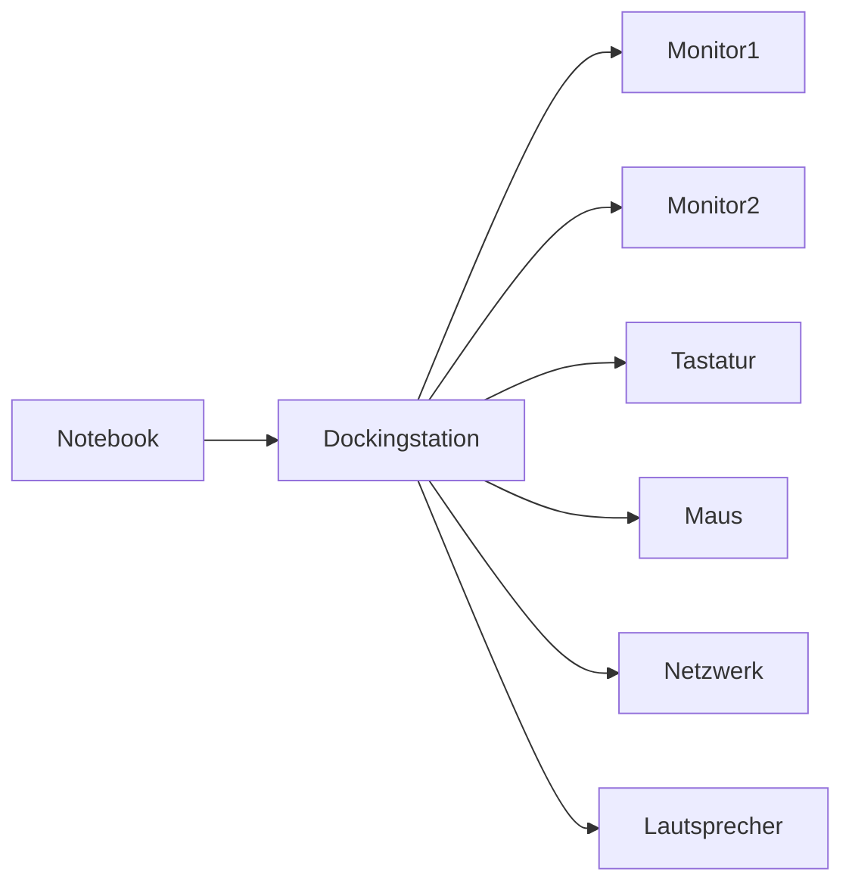

---
# Identity (stable; never change after publishing)
id: ap1-0154
slug: dockingstation-funktionen

# Display
title: "Dockingstation für Notebooks – Funktionen"

# Classification / navigation (machine-side)
module: "Beurteilen marktgängiger IT-Systeme und Lösungen"
topics: ["Hardware", "Peripherie"]
tags: ["prüfungsrelevant", "definition"]

# Flashcard payload
card:
  type: basic
  question: "Wofür wird eine Dockingstation für Notebooks verwendet?"
  answer: "Eine Dockingstation erweitert ein Notebook um zusätzliche Schnittstellen und Anschlüsse (z. B. USB, Netzwerk, Videoausgänge) und ermöglicht den einfachen Anschluss von Peripheriegeräten wie Monitor, Tastatur, Maus oder Netzwerk über eine zentrale Verbindung."
  examples:
    - "Anschluss mehrerer Monitore über HDMI oder DisplayPort"
    - "Netzwerkanschluss (Ethernet), wenn das Notebook keinen LAN-Port besitzt"
    - "Zusätzliche USB-Ports für Maus, Tastatur oder externe Laufwerke"

# Lifecycle
status: published
created: "2026-03-11"
updated: "2026-03-11"
---

## Dockingstation für Notebooks – Funktionen

Eine **Dockingstation** wird verwendet, um **mobile Geräte wie Notebooks schnell mit einer stationären Arbeitsumgebung zu verbinden**.

Durch eine einzige Verbindung (z. B. **USB-C, Thunderbolt oder proprietärer Docking-Port**) kann das Notebook auf zahlreiche zusätzliche Schnittstellen zugreifen.

Das erleichtert besonders den Wechsel zwischen **mobiler Nutzung und Arbeitsplatzbetrieb**.

---

## Typische Funktionen einer Dockingstation

| Funktion | Beschreibung |
|---|---|
| Erweiterung von Schnittstellen | Bereitstellung zusätzlicher Ports, die am Notebook fehlen |
| Anschluss von Monitoren | Unterstützung mehrerer Displays über HDMI, DVI oder DisplayPort |
| Netzwerkverbindung | Ethernet-Anschluss für stabile LAN-Verbindung |
| Anschluss von Peripherie | Tastatur, Maus, Drucker oder externe Laufwerke über USB |
| Audioanschlüsse | Anschluss von Lautsprechern oder Headsets |
| Stromversorgung | Viele Dockingstationen laden gleichzeitig das Notebook |

---

## Typische Anschlüsse

Moderne Dockingstationen bieten häufig:

- **USB-Ports** (USB-A / USB-C)
- **Videoanschlüsse** (HDMI, DisplayPort, teilweise DVI)
- **LAN (RJ45)**
- **Audio (3,5 mm Klinke)**
- teilweise **Thunderbolt**
- ältere Modelle auch **PS/2, seriell oder parallel**

Einige Dockingstationen ermöglichen z. B.:

- **2× HDMI**
- **2× DisplayPort**
- Kombination aus mehreren Videoausgängen für **Multi-Monitor-Setups**

---

## Funktionsprinzip

Das Notebook verbindet sich **über nur ein Kabel** mit der Dockingstation, welche anschließend alle angeschlossenen Geräte bereitstellt.

---

## Praktisches Beispiel

Ein Mitarbeiter nutzt ein Notebook im Büro:

**Unterwegs**

- nur Notebook

**Am Arbeitsplatz**

Notebook wird an Dockingstation angeschlossen:

- 2 externe Monitore
- LAN-Netzwerk
- USB-Tastatur
- USB-Maus
- Lautsprecher

→ Alle Geräte sind **sofort verbunden**, ohne jedes Kabel einzeln anzustecken.

---

## Prüfungsrelevanz (IHK / AP1)

Typische Aspekte:

- **Dockingstation = Portreplikator / Schnittstellenerweiterung**
- ermöglicht **stationären Arbeitsplatz mit Notebook**
- Verbindung meist über **eine zentrale Schnittstelle**

**Merksatz**

> Eine Dockingstation erweitert ein Notebook um zusätzliche Anschlüsse und verbindet mehrere Peripheriegeräte über eine einzige Verbindung.

---

## Häufige Missverständnisse

### Dockingstation vs. Portreplikator

- **Portreplikator:** repliziert nur vorhandene Anschlüsse
- **Dockingstation:** kann zusätzlich **neue Schnittstellen bereitstellen**

In der Praxis werden beide Begriffe jedoch häufig **synonym verwendet**.

---