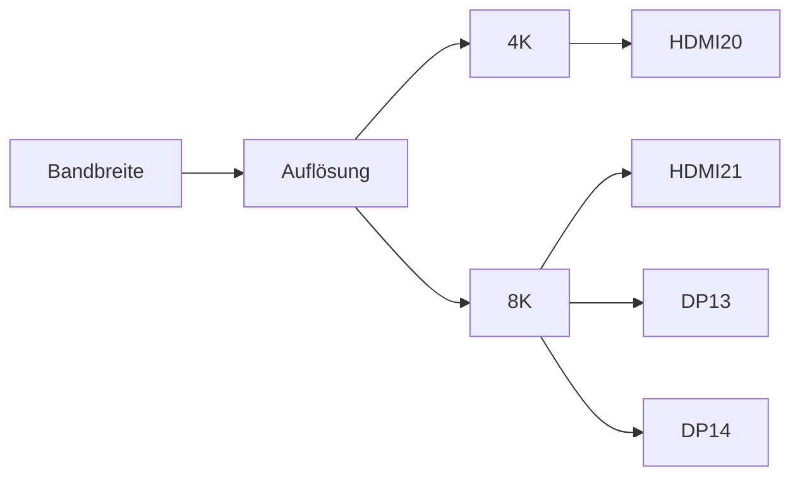

---
# Identity (stable; never change after publishing)
id: ap1-0155
slug: video-schnittstellen-4k-8k

# Display
title: "Video-Schnittstellen für 4K und 8K"

# Classification / navigation (machine-side)
module: "Beurteilen marktgängiger IT-Systeme und Lösungen"
topics: ["Hardware", "Grafikschnittstellen"]
tags: ["prüfungsrelevant", "vergleich"]

# Flashcard payload
card:
  type: basic
  question: "Welche Video-Schnittstellen sind für 4K und 8K Auflösung geeignet?"
  answer: "Für hohe Auflösungen sind HDMI 2.0, HDMI 2.1, DisplayPort 1.3 und DisplayPort 1.4 geeignet. HDMI 1.4 ist dagegen nur für Full-HD geeignet und für moderne 4K/8K-Anwendungen meist nicht ausreichend."
  examples:
    - "HDMI 2.0 → bis 4K"
    - "HDMI 2.1 → bis 8K"
    - "DisplayPort 1.3 / 1.4 → bis 8K"

# Lifecycle
status: published
created: "2026-03-11"
updated: "2026-03-11"
---

## Video-Schnittstellen für 4K und 8K

Für hohe Bildschirmauflösungen wie **4K (Ultra HD)** oder **8K** sind leistungsfähige **Video-Schnittstellen mit hoher Datenrate** notwendig.  
Die maximal unterstützte Auflösung hängt direkt von der **Bandbreite (Übertragungsrate)** der Schnittstelle ab.

---

## Vergleich der Video-Schnittstellen

| Schnittstelle | Maximale Datenrate | Maximale Auflösung | Bewertung |
|---|---|---|---|
| HDMI 1.4 | 10,2 GBit/s | Full HD / begrenztes 4K | ❌ nicht geeignet |
| HDMI 2.0 | 18,0 GBit/s | 4K | ✅ geeignet |
| HDMI 2.1 | 38,4 GBit/s | 8K | ✅ geeignet |
| DisplayPort 1.3 | 25,9 GBit/s | 8K | ✅ geeignet |
| DisplayPort 1.4 | 32,4 GBit/s | 8K | ✅ geeignet |

---

## Einordnung

### Nicht geeignet

**HDMI 1.4**

- max. **10,2 GBit/s**
- hauptsächlich für **Full-HD**
- für moderne **4K/8K-Anwendungen unzureichend**

---

### Geeignet

**HDMI 2.0**

- max. **18,0 GBit/s**
- unterstützt **4K-Auflösung**

**HDMI 2.1**

- max. **38,4 GBit/s**
- unterstützt **8K-Auflösung**

**DisplayPort 1.3**

- max. **25,9 GBit/s**
- unterstützt **8K-Auflösung**

**DisplayPort 1.4**

- max. **32,4 GBit/s**
- unterstützt **8K-Auflösung**

---

## Zusammenhang Bandbreite und Auflösung

Je **höher die Auflösung**, desto **größer ist die benötigte Datenrate** der Video-Schnittstelle.

---

## Praktisches Beispiel

Ein Arbeitsplatz mit einem **4K-Monitor** benötigt mindestens:

- **HDMI 2.0**
- oder **DisplayPort 1.3 / 1.4**

Für einen **8K-Monitor** sind erforderlich:

- **HDMI 2.1**
- oder **DisplayPort 1.3 / 1.4**

---

## Prüfungsrelevanz (IHK / AP1)

Typische Prüfungsfragen:

- Welche Schnittstelle unterstützt **4K oder 8K**?
- Welche Version von **HDMI oder DisplayPort** wird benötigt?

**Merksatz**

> Je höher die Auflösung, desto höher muss die Bandbreite der Videoschnittstelle sein.

---