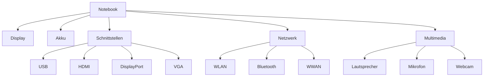

---
# Identity (stable; never change after publishing)
id: ap1-0156
slug: technische-merkmale-notebook

# Display
title: "Technische Merkmale eines Notebooks"

# Classification / navigation (machine-side)
module: "Beurteilen marktgängiger IT-Systeme und Lösungen"
topics: ["Hardware", "Mobile Systeme"]
tags: ["prüfungsrelevant", "definition"]

# Flashcard payload
card:
  type: multi
  question: "Welche technischen Merkmale hat ein Notebook?"
  answer: "Ein Notebook besitzt typischerweise ein integriertes Display, Akku, externe Schnittstellen (z. B. USB, HDMI, DisplayPort), drahtlose Kommunikation (WLAN, Bluetooth, teilweise WWAN), Audio-Komponenten (Lautsprecher und Mikrofon), eine Webcam, eine interne Netzwerkkarte sowie optional Erweiterungsmöglichkeiten wie Dockingstation-Anschluss, Mini-PCI-Express-Slot oder Kartenleser."
  examples:
    - "integriertes Display und Akku für mobilen Betrieb"
    - "Schnittstellen wie USB, HDMI oder DisplayPort"
    - "WLAN und Bluetooth für drahtlose Kommunikation"

# Lifecycle
status: published
created: "2026-03-11"
updated: "2026-03-11"
---

## Technische Merkmale eines Notebooks

Ein **Notebook** ist ein **mobiler Computer**, der alle wesentlichen Hardwarekomponenten eines PCs in einem kompakten Gerät integriert.  
Dadurch kann es sowohl **mobil mit Akku** als auch **stationär mit Netzteil** betrieben werden.

---

## Typische technische Bestandteile

| Kategorie | Komponenten |
|---|---|
| Anzeige | integriertes Display |
| Energieversorgung | Akku, externes Netzteil |
| Erweiterungen | Anschluss für Dockingstation, Mini-PCI-Express-Slot |
| Schnittstellen | USB, HDMI, DisplayPort / Mini-DisplayPort, VGA, FireWire |
| Speichergeräte | teilweise integrierter 4-in-1 Kartenleser |
| Kommunikation | WLAN, Bluetooth, teilweise WWAN |
| Multimedia | integrierte Lautsprecher, Mikrofon |
| Kamera | integrierte Webcam |
| Netzwerk | interne Netzwerkkarte |

---

## Beispielhafte Hardwarestruktur

---

## Bedeutung für den mobilen Einsatz

Diese Komponenten ermöglichen typische Notebook-Eigenschaften:

- **Mobiler Betrieb** durch Akku  
- **Stationärer Einsatz** über Netzteil und Dockingstation  
- **Netzwerkzugang** über WLAN oder LAN  
- **Multimedia-Funktionen** durch Kamera, Mikrofon und Lautsprecher  

---

## Prüfungsrelevanz (IHK / AP1)

Typische Fragen:

- grundlegende **Hardwaremerkmale mobiler Systeme**
- typische **Notebook-Schnittstellen**
- Unterschiede zwischen **Notebook und Desktop-PC**

**Merksatz**

> Ein Notebook kombiniert Display, Akku, Kommunikationsmodule und Schnittstellen in einem kompakten mobilen System.

---

## Hinweis zur Entwicklung moderner Notebooks

Einige ältere Schnittstellen wie **VGA, FireWire oder Mini-PCI-Express** werden heute häufig durch moderne Technologien ersetzt, z. B.:

- **USB-C**
- **Thunderbolt**
- **NVMe / M.2 Erweiterungsslots**

---