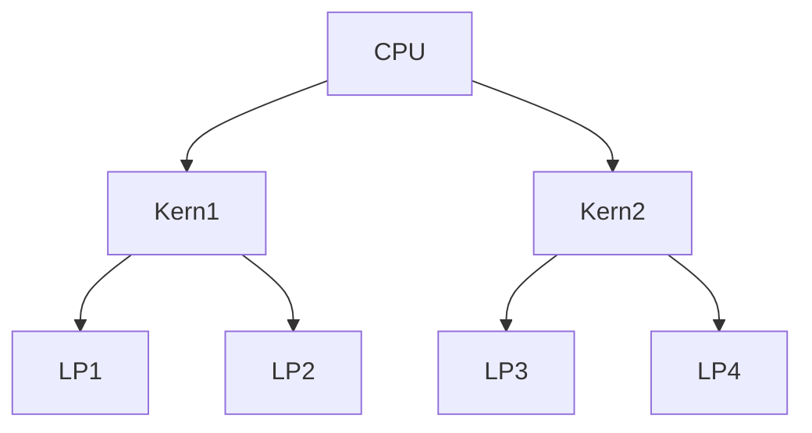

---
# Identity (stable; never change after publishing)
id: ap1-0157
slug: logische-prozessoren

# Display
title: "Logische Prozessoren"

# Classification / navigation (machine-side)
module: "Beurteilen marktgängiger IT-Systeme und Lösungen"
topics: ["Hardware", "CPU"]
tags: ["prüfungsrelevant", "definition"]

# Flashcard payload
card:
  type: definition
  question: "Was bezeichnet man in der CPU-Technologie als logische Prozessoren?"
  answer: "Logische Prozessoren sind virtuelle Verarbeitungseinheiten einer CPU, die durch Technologien wie Hyper-Threading (HTT) oder Simultaneous Multithreading (SMT) entstehen. Sie ermöglichen es, mehrere Threads parallel auf einem physischen Prozessorkern auszuführen und dadurch die Auslastung und Leistung der CPU zu verbessern."
  examples:
    - "Ein Prozessor mit 8 physischen Kernen und Hyper-Threading kann 16 logische Prozessoren bereitstellen."
    - "Das Betriebssystem sieht logische Prozessoren als separate Verarbeitungseinheiten im Task-Manager."

# Lifecycle
status: published
created: "2026-03-11"
updated: "2026-03-11"
---

## Logische Prozessoren

**Logische Prozessoren** sind zusätzliche, virtuelle Verarbeitungseinheiten innerhalb einer CPU.  
Sie entstehen durch **Multithreading-Technologien**, die es ermöglichen, dass ein einzelner physischer CPU-Kern **mehrere Threads gleichzeitig bearbeiten kann**.

Das Ziel ist eine **bessere Auslastung der CPU-Ressourcen**.

---

## Zusammenhang zwischen Kern und logischem Prozessor

| Begriff | Bedeutung |
|---|---|
| Physischer Kern | Tatsächliche Recheneinheit der CPU |
| Logischer Prozessor | Virtuelle Verarbeitungseinheit pro Thread |
| Thread | Einzelner Ausführungsstrang eines Programms |

Ein physischer Kern kann durch Multithreading **mehrere logische Prozessoren bereitstellen**.

---

## Technologien

| Technologie | Beschreibung |
|---|---|
| Hyper-Threading (Intel) | Ein physischer Kern stellt zwei logische Prozessoren bereit |
| Simultaneous Multithreading (SMT) | Allgemeines Verfahren zur parallelen Thread-Ausführung |

---

## Funktionsprinzip

Beispiel:

- **2 physische Kerne**
- jeder Kern kann **2 Threads parallel ausführen**

→ Betriebssystem erkennt **4 logische Prozessoren**

---

## Beispiel aus der Praxis

Im **Windows Task-Manager** werden logische Prozessoren angezeigt.

Beispiel:

- CPU mit **24 physischen Kernen**
- durch Multithreading **32 logische Prozessoren**

Das Betriebssystem kann Programme auf diese **virtuellen Verarbeitungseinheiten verteilen**.

---

## Prüfungsrelevanz (IHK / AP1)

Typische Prüfungsfragen:

- Unterschied zwischen **physischem Kern und logischem Prozessor**
- Zusammenhang mit **Hyper-Threading**
- Interpretation der **CPU-Anzeige im Task-Manager**

**Merksatz**

> Logische Prozessoren sind virtuelle CPU-Einheiten, die durch Multithreading entstehen und mehrere Threads parallel ausführen können.

---

## Wichtig zu verstehen

Mehr logische Prozessoren bedeuten:

- **bessere Auslastung der CPU**
- **höhere Parallelität**

Aber:

- sie ersetzen **keine echten zusätzlichen Kerne**
- Leistungssteigerung ist **abhängig von der Software**

---