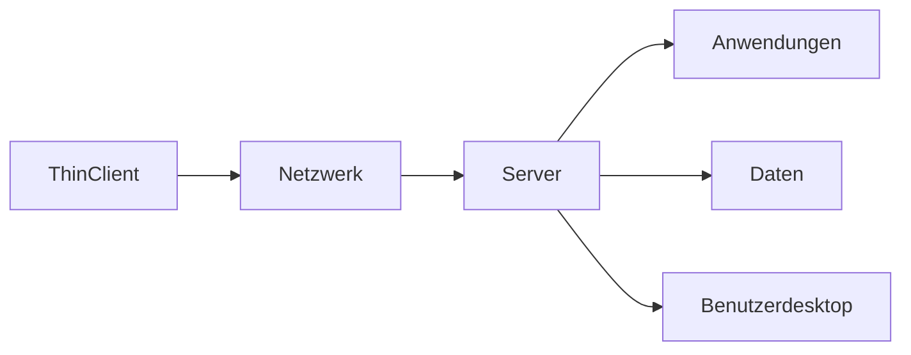

---
# Identity (stable; never change after publishing)
id: ap1-0160
slug: thin-client-definition

# Display
title: "Thin Client"

# Classification / navigation (machine-side)
module: "Beurteilen marktgängiger IT-Systeme und Lösungen"
topics: ["Systemarchitektur", "Virtualisierung"]
tags: ["prüfungsrelevant", "definition"]

# Flashcard payload
card:
  type: definition
  question: "Wie definiert man den Begriff Thin Client?"
  answer: "Ein Thin Client ist ein schlanker Computer, der hauptsächlich zur Darstellung von Anwendungen dient und seine Rechenleistung überwiegend von einem zentralen Server bezieht. Programme, Daten und Verarbeitung laufen auf dem Server, während der Thin Client hauptsächlich Ein- und Ausgaben übernimmt."
  examples:
    - "Virtuelle Desktop-Infrastruktur (VDI) mit zentralen Servern"
    - "Arbeitsplätze im Unternehmen, bei denen Anwendungen auf einem Terminalserver laufen"

# Lifecycle
status: published
created: "2026-03-11"
updated: "2026-03-11"
---

## Thin Client

Ein **Thin Client** ist ein **reduzierter Computer**, der hauptsächlich als **Zugriffsgerät auf zentrale Serverressourcen** dient.

Die eigentliche Verarbeitung – also **Programme, Daten und Berechnungen** – findet auf einem **Server oder im Rechenzentrum** statt.

Der Thin Client übernimmt hauptsächlich:

- Anzeige der Benutzeroberfläche
- Eingabe über Maus und Tastatur
- Netzwerkkommunikation mit dem Server

---

## Funktionsprinzip

Der Server stellt dem Benutzer einen **virtuellen Desktop oder Anwendungen** bereit.

---

## Typische Eigenschaften

| Merkmal | Beschreibung |
|---|---|
| geringe lokale Rechenleistung | Hauptverarbeitung erfolgt auf dem Server |
| zentrale Verwaltung | Software wird auf dem Server installiert |
| einfache Hardware | oft lüfterlos und energieeffizient |
| Netzwerkabhängig | benötigt Verbindung zum Server |

---

## Typische Hardware eines Thin Clients

Thin Clients besitzen meist nur grundlegende Komponenten:

- Netzwerkanschluss
- USB-Anschlüsse
- Audio- und Displayanschlüsse
- teilweise WLAN

Sie besitzen meist **keine leistungsstarke CPU oder große lokale Speichermedien**.

---

## Einsatz in Unternehmen

Viele Unternehmen setzen Thin Clients in Verbindung mit:

- **Terminalservern**
- **Remote Desktop Services**
- **Virtual Desktop Infrastructure (VDI)**

Vorteile:

- zentrale Wartung
- hohe Sicherheit
- geringerer Energieverbrauch
- geringere Hardwarekosten

---

## Prüfungsrelevanz (IHK / AP1)

Typische Prüfungsfragen:

- Definition **Thin Client**
- Unterschied zwischen **Thin Client und Fat Client**
- Zusammenhang mit **VDI oder Terminalserver**

**Merksatz**

> Ein Thin Client ist ein schlanker Arbeitsplatzrechner, bei dem Programme und Daten zentral auf einem Server verarbeitet werden.

---

## Abgrenzung

| System | Eigenschaften |
|---|---|
| Thin Client | Verarbeitung überwiegend auf Server |
| Fat Client | Anwendungen laufen lokal auf dem Gerät |

---