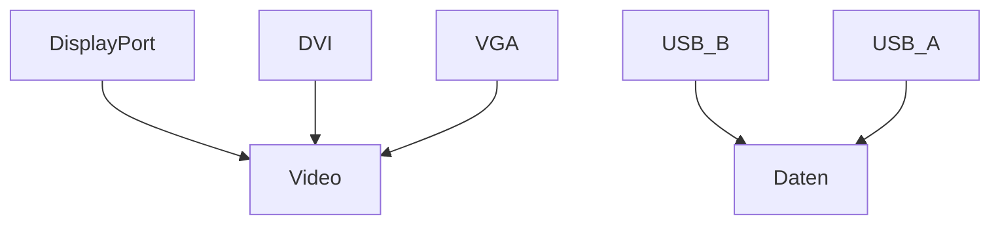

## Schnittstellen erkennen (DisplayPort, DVI, VGA, USB)

### Kurzdefinition

Schnittstellen sind **physische Anschlüsse**, über die Geräte **Daten oder Videosignale** austauschen.

---

## Grundprinzip

Man unterscheidet hier zwei Hauptkategorien:

### 1. Videoschnittstellen
Dienen zur Übertragung von Bild (und teilweise Audio):

- **DisplayPort** → modern, digital
- **DVI** → digital oder kombiniert (digital + analog)
- **VGA** → rein analog, veraltet

### 2. Datenschnittstellen (USB)
Dienen zur Verbindung von Peripheriegeräten:

- **USB Typ B** → meist am Gerät (z. B. Drucker, Monitor-Hub)
- **USB Typ A** → meist am Computer (Standardanschluss)

---

## Strukturierte Übersicht

| Schnittstelle | Kategorie | Signalart | Typische Verwendung |
|---|---|---|---|
| DisplayPort | Video | digital | Monitore, moderne GPUs |
| DVI | Video | digital / analog | ältere Monitore |
| VGA | Video | analog | sehr alte Systeme |
| USB Typ B | Daten | digital | Drucker, Monitore |
| USB Typ A | Daten | digital | Maus, Tastatur, USB-Sticks |

---

## Praktisches Beispiel

Ein Monitor kann mehrere Anschlüsse besitzen:

- **DisplayPort** → Verbindung für hochauflösendes Bild
- **DVI/VGA** → Kompatibilität mit älteren PCs
- **USB Typ B** → verbindet Monitor mit PC (für USB-Hub im Monitor)
- **USB Typ A** → Anschlüsse direkt am Monitor für Geräte

---

## Vereinfachtes Schema

---

## Prüfungsrelevanz (IHK / AP1)

Typische Anforderungen:

- **Unterscheidung analog vs. digital**
- **Zuordnung von Schnittstellen zu ihrem Zweck**
- **Erkennen typischer Anschlüsse (auch ohne Bildbeschreibung!)**

---

## Häufige Fehler

- **DVI immer als rein digital ansehen**  
  → falsch, es gibt auch DVI-I (analog + digital)

- **USB Typ A und B verwechseln**  
  → A = Host (PC), B = Gerät

- **VGA als digitalen Anschluss einstufen**  
  → falsch, VGA ist immer analog

---

## Merksatz

> DisplayPort, DVI und VGA übertragen Video – USB überträgt Daten.
